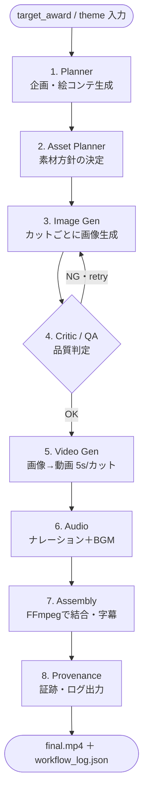

# AGEWEC 2026 — エージェント動画制作ワークフロー設計図

**方針**: LangGraph によるエージェント自律実行。ローカル中心（無料）で、画像/動画生成ノードだけクラウドAPIに差し替え可能なハイブリッド構成。
**実行環境**: MacBook Pro M5 / 32GB（メイン）＋ M5 24GB（並列サブ）。動画化は ComfyUI をローカルサーバとして常駐させ、LangGraph から HTTP で叩く。
**最終成果物**: 60秒以下のプロモーション動画（mp4）＋ 制作証跡（プロンプト・ログ・スクショ）。

---

## 1. 全体グラフ



自律性の核は **3⇄4のQAリトライループ**（生成→自己評価→不合格カットだけ再生成）と、**入力からmp4まで人手を介さず一気通貫で走る**点。これが評価軸「AI Autonomy」に効く。

---

## 2. State（グラフ全体で持ち回す状態）

```
AgentState = {
  target_award: str          # "夜景賞" / "観光賞" / "DX賞" / "環境賞"
  theme: str                 # 一言テーマ
  storyboard: list[Cut]      # 各カットの構造化データ
  assets: dict[cut_id -> path]   # 生成/取得した画像・動画パス
  qa_verdicts: dict[cut_id -> {ok, reason, retries}]
  audio: {narration_path, bgm_path}
  final_video: path
  log: list[event]           # 全ステップの証跡
  config: {backend: "local"|"cloud", max_retries, ...}
}

Cut = { id, scene_desc, image_prompt, motion_prompt, narration, seconds }
```

`config.backend` を切り替えるだけで、画像/動画ノードがローカルかクラウドかを選ぶ（グラフ構造は不変）。

---

## 3. 各ノードの役割・入出力・バックエンド

| # | ノード | 入力 → 出力 | ローカル（無料） | クラウド差し替え |
|---|--------|-------------|------------------|------------------|
| 1 | **Planner** | award/theme → storyboard(JSON) | ローカルLLM（Ollama等） | ChatGPT/Gemini API |
| 2 | **Asset Planner** | storyboard → 素材方針（生成 or 北九州パレット公式素材） | ルール＋LLM判断 | 同左 |
| 3 | **Image Gen** | image_prompt → 画像 | ComfyUI + FLUX（ローカル） | Kling/Veo/Runway等 |
| 4 | **Critic/QA** | 画像＋prompt → {ok, reason} | ローカル視覚LLM or ヒューリスティック | GPT-4V系API |
| 5 | **Video Gen** | 画像＋motion_prompt → 5s動画 | ComfyUI + Wan 2.1(1.3B) / LTX-Video（GGUF） | Kling/Veo/Runway |
| 6 | **Audio** | narration → 音声＋BGM | VOICEVOX（TTS）＋ライセンスフリーBGM | ElevenLabs等 |
| 7 | **Assembly** | クリップ＋音声＋字幕 → mp4 | FFmpeg（ローカルのみ） | — |
| 8 | **Provenance** | state全体 → log/スクショ束 | 自前スクリプト | — |

> Metal は FP8 非対応。ローカル動画化は **GGUF量子化版**を使い、2〜4秒・480〜512p の短クリップを積む前提（実測 LTX 4秒 ≈ 7分）。時間がかかる動画化だけをクラウドに逃がす、という判断も `config.backend` で可能。

---

## 4. 制御フロー（条件分岐）

- **開始ルーター**: `target_award` により Planner のプロンプトを分岐（例：夜景賞→工場夜景・水面反射を強調）。
- **QAループ**: `qa_verdicts[cut].ok == false and retries < max_retries` の間、Image Gen に戻る。上限到達で「ベストエフォート採用＋ログに記録」して前進（無限ループ防止）。
- **並列化**: カットは独立なので Image Gen / Video Gen をカット単位で並列実行可能（M5×2台を活かす）。

---

## 5. AGEWEC 評価軸 × ノード対応

| 評価軸 | 効かせるノード／設計 |
|--------|----------------------|
| Tourism Appeal | Planner（award別の訴求設計）＋ Asset Planner（公式素材活用） |
| Emotional Impact / Narrative | Planner の絵コンテ構成（オープニング・見せ場・締め） |
| **AI Autonomy** | QA自己修正ループ＋入力→mp4の一気通貫自動実行 |
| **Workflow Design & Reproducibility** | Provenance ノードが log/prompt/tool版/スクショを自動出力 |
| Technical Creativity | ローカル自律実行＋バックエンド抽象化のハイブリッド設計 |

---

## 6. 提出フォーム項目のカバー

Provenance ノードの出力を、そのまま応募フォームに転記できる形にする：

- 使用AIツール・モデル → `config` と各ノードのモデル名を集約
- ワークフロー説明 → 本設計図の1章グラフをそのまま記述
- スクリーンショットURL（証跡） → 各ステップのスクショを束ねてクラウド共有
- 使用モデルのライセンス区分 → Asset/モデル表から「商用可/非商用/不明」を判定

---

## 7. 実装の最小構成（次段階の目安）

- `graph.py` — LangGraph の StateGraph 定義（ノード登録・条件エッジ）
- `nodes/` — planner / image / qa / video / audio / assembly / provenance
- `backends/` — local（ComfyUI HTTP, Ollama, VOICEVOX）/ cloud（各API）の共通インターフェース
- `config.yaml` — backend 切替・retry上限・解像度・尺
- ComfyUI をローカル常駐（画像=FLUX, 動画=Wan1.3B/LTX の GGUF ワークフローを事前用意）

---

## 8. 判断メモ（事実と提案の区別）

- **事実**: AGEWECは無料・ローカルでも受賞可、評価は自律性と再現性を重視（公式ガイド／評価基準より）。規約上の提出物は動画作品。
- **提案**: LangGraphでの自律化は「AI Autonomy」に直結するので投資価値が高い。ただし全ローカル動画化は遅いので、**動画化ステップだけクラウド差し替え可能にする**のが8日間で完成させる現実解。
- **要確認（運営へ）**: 複数応募の可否／「デジタル体験」の受付範囲（別途）。
