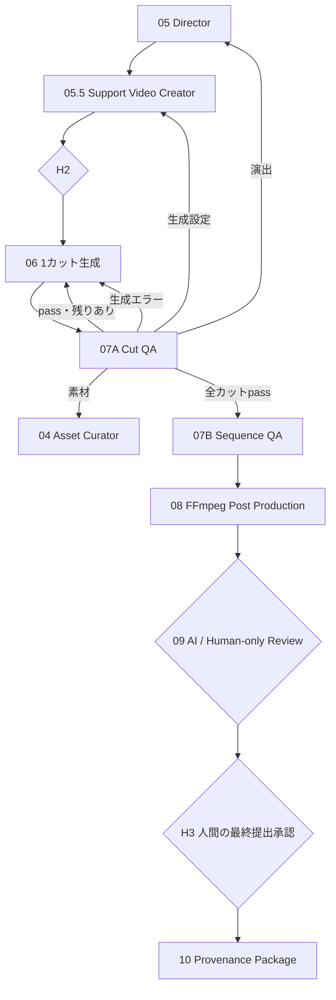

# Phase 05.5–10 Implementation Summary

## 実装された経路

## コード

- `pipeline_runtime.py`: Phase 05.5–10の処理
- `media_tools.py`: FFmpeg / FFprobe
- `graph_safe.py`: カット単位の循環と差し戻し
- `review.py`: 共通Review GateとH3強制確認
- `state.py`: Queue、カット結果、QA、提出成果物のState

## 実行モード

- 開発確認: `config.yaml`の`production.backend: mock`
- LLM + ComfyUI: `config_llm.yaml`
- AI Review Boardなし: `review_board.mode: human_only`
- AI Review Boardあり: `review_board.mode: ai`

## 残る外部接続

コード上の工程は完成しているが、次はモデルや素材の準備が別途必要。

- 全カットのローカル元画像
- 実ComfyUIでの全カット生成
- 映像内容を判定するVLM Provider
- 字幕、ナレーション、ACE-Step BGMを使う場合の実音声ファイル

