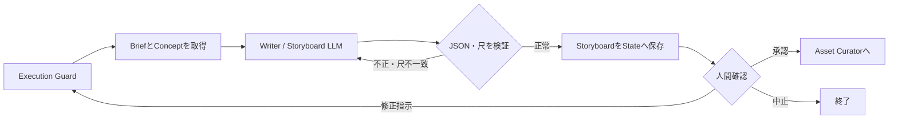

# Phase 03: Writer / Storyboard

## 目的

承認済みの`ProjectBrief`と`CreativeConcept`を、秒数付きの具体的な
`Storyboard`へ変換する。

このフェーズでは台本、ナレーション、カット構成、各カットのメディア方式を
決めるが、使用する具体的な写真や動画生成プロンプトはまだ決めない。

## 修正後の確定仕様

状態: `implemented`

- Phase 01の`target_duration_seconds`をカットへ配分し、合計尺を必ず一致させる。
- カット順と秒数はこの工程で確定し、Phase 08は独自判断で増減しない。
- `media_requirement`を次の3値で使用する。

```text
video_required   : 最終提出では動画クリップが必須
still_allowed    : 意図的な静止画でもよい
still_preferred  : 演出上、静止画を優先する
```

- 今回の最終版は原則として全カットを`video_required`にする。
- ComfyUIのImage-to-Videoへ渡す入力写真は、最終映像中の「静止画カット」とは区別する。
- 各カットに`time_of_day`、`visual_role`、`location`、`subject`を追加し、素材検索と演出決定へ渡す。
- ナレーションは割り当て秒数内に収まるか検証する。
- フレーム数への変換は後段のSupport Video Creatorが行う。モデル上限を超えたカットの意味的な分割は、Writer / StoryboardまたはDirectorへ戻して行う。

## 処理フロー



## 最初に渡す情報

### プロジェクト指定

LangGraphのStateに保存されている元の`project`を渡す。

```yaml
project:
  target_award: 夜景賞
  theme: 北九州の魅力を世界へ
  target_duration_seconds: 30
```

### 承認済みProjectBrief

Executive Producerが作成した次の情報を渡す。

- 制作目的
- 応募する賞
- 想定視聴者
- 制作する成果物
- 守るべき制約
- 成功基準

### 承認済みCreativeConcept

Creative Directorが作成した次の情報を渡す。

- コンセプトタイトル
- ログライン
- トーン
- カラーパレット
- カメラ表現
- 映像全体の連続性
- 音楽・音響の方向性
- コンセプト段階の成功基準

再実行の場合は、人間が前回入力した`review_feedback`も渡す。

## このフェーズの処理

1. Execution Guardがフェーズ実行回数、全体実行数、経過時間を確認する
2. `project`、`ProjectBrief`、`CreativeConcept`を取得する
3. Writer / Storyboardの役割プロンプトと入力情報をLM StudioのLLMへ渡す
4. LLMがカット単位の台本と絵コンテを作成する
5. 出力を`Storyboard`のJSON Schemaで検証する
6. カットID、秒数、全体尺を検証する
7. 不正がある場合はLLMへ修正を依頼する
8. 正常な結果とLLM実行情報をLangGraphのStateへ保存する
9. Review Gateで人間の判断を待つ

各カットでは次の内容を決定する。

- カットID
- カット名
- 画面に必要な場面
- ナレーション文
- カット秒数
- `media_requirement`
- 時刻帯、映像上の役割、場所、被写体

`media_requirement`は次の3種類。

- `video_required`: 最終成果物で動画クリップが必須
- `still_allowed`: 意図的な静止画を許可
- `still_preferred`: 演出上、静止画を優先

LLM出力の内部修正試行は、現在は初回を含め最大3回。

## 尺と形式の検証

次を自動検証する。

- `total_seconds`が0より大きい
- 各カットの`seconds`が0より大きい
- カットIDが正の整数
- カットIDが重複していない
- 各カットの秒数合計と`total_seconds`の差が0.25秒以内
- `total_seconds`とプロジェクト目標尺の差が0.25秒以内
- ナレーション文字数が設定された秒数内の上限に収まる

目標尺が30秒の場合、Storyboard全体とカット合計は30秒へ一致させる。

## 次のステップへ渡す情報

形式は次の`Storyboard` JSON。

```json
{
  "total_seconds": 30,
  "cuts": [
    {
      "id": 1,
      "name": "北九州の一日",
      "scene": "昼の街と人々の活動を映す",
      "narration": "海と山に抱かれた、動き続ける街。",
      "seconds": 6,
      "media_requirement": "video_required",
      "time_of_day": "day",
      "visual_role": "opening",
      "location": "小倉",
      "subject": "街と人"
    },
    {
      "id": 2,
      "name": "夜への転換",
      "scene": "夕景から街の灯りがともる様子へ移る",
      "narration": "やがて街は、光の表情を見せ始める。",
      "seconds": 6,
      "media_requirement": "video_required",
      "time_of_day": "sunset",
      "visual_role": "transition",
      "location": "北九州市街",
      "subject": "夕景と街明かり"
    },
    {
      "id": 3,
      "name": "光のクライマックス",
      "scene": "皿倉山から見た壮大な北九州の夜景",
      "narration": "北九州、その輝きは夜空へ続く。",
      "seconds": 8,
      "media_requirement": "video_required",
      "time_of_day": "night",
      "visual_role": "climax",
      "location": "皿倉山",
      "subject": "北九州の夜景"
    }
  ]
}
```

実際の出力では、全カットの秒数合計を`total_seconds`と一致させる。

合わせて以下もStateへ保存する。

- ステータス
- 要約
- 信頼度
- 使用したプロバイダとモデル
- トークン使用量
- LLM呼び出し回数
- 実行時間
- エラー・警告

Asset CuratorはこのStoryboardを受け取り、各カットの`scene`と
構造化された素材要件に合う具体的な素材を選定する。

## 人間確認

現在は`manual`モードなので、Writer / Storyboardの直後にある
Review Gateで必ず停止する。

### 選択できる操作

- `approve`: 内容を承認してAsset Curatorへ進む
- `retry_with_feedback`: 修正指示を渡して同じフェーズを再実行する
- `abort`: ワークフローを終了する

### 現在、修正指示できる範囲

- カット数
- カットの順番
- 各カットで必要な場面
- ナレーション
- 各カットの秒数配分
- `media_requirement`の変更
- 全体のテンポ
- 物語の展開

例:

```text
カット数を5つに減らしてください。
昼の活動から始め、夕景を経て、最後の8秒を壮大な夜景にしてください。
動画生成を使うカットは2つまでにしてください。
```

修正指示を受けると、特定カットだけを直接編集するのではなく、
LLMが`Storyboard`全体を再生成する。

### 現在、修正指示だけでは変更できないもの

- プロジェクト全体の正式な目標尺
- `target_award`
- 元の`theme`
- `ProjectBrief`
- `CreativeConcept`
- 実際に使用する写真
- ComfyUIの解像度、frames、steps、fps
- Review Policyや実行上限などのシステム設定

正式な目標尺が30秒のまま「40秒にして」と指示すると、尺検証に失敗する。

Writer / StoryboardのReview Gateから、Creative Directorや
Executive Producerへ直接戻る経路も現在は実装されていない。

## 現在の注意点

- カット数の最大値はまだ定義されていない
- ナレーション音声は生成しない
- 具体的な素材は次のAsset Curatorで選定する

## エラー時

承認済み`ProjectBrief`または`CreativeConcept`が存在しない場合は実行せず、
結果を`error`としてReview Gateへ渡す。

LLM接続失敗、JSON検証失敗、尺の不一致が解決しない場合も`error`として
Review Gateへ渡し、人間は修正して再実行するか、中止できる。
