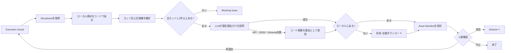
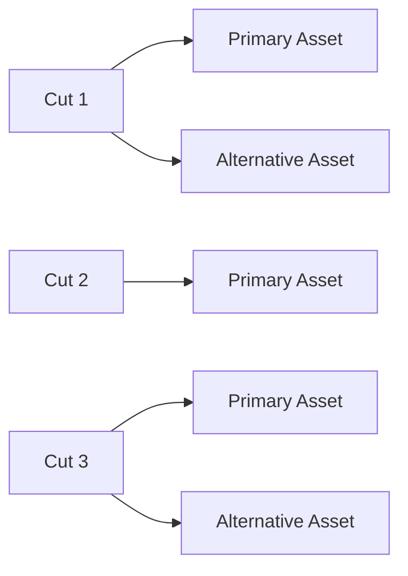

# Phase 04: Asset Curator

## 目的

Writer / Storyboardが作成した各カットについて、AGEWEC公式素材カタログから
場面に適した具体的な写真を選定する。

各カットには1件以上の素材を必須とし、必要に応じて複数候補を持てる設計を
目標とする。

AGEWEC公式素材カタログ内の画像はAGEWEC提出用途で使用可能という前提とし、
権利リスクの判定工程は省略する。ただし、出典情報は証跡として保存する。

## 修正後の確定仕様

状態: `implemented`（全素材の事前ダウンロードだけは別タスク）

- 全カットに最低1件の素材を必須とし、0件のカットがあれば次工程へ進めない。
- 複数候補は`primary`と`alternatives`へ順位付けする。
- 修正時は対象カットだけを再選定でき、承認済みの他カットを固定する。
- AGEWEC公式素材には`usage_scope: agewec_submission`を記録し、重複する権利判定は省略する。
- 外部素材は自動採用せず、別の権利確認対象にする。
- 公式素材は事前にまとめてローカル保存し、通常実行ではローカルカタログを検索する。
- カタログには時刻帯、用途、場所、被写体、ローカルパス、取得日時、ファイルサイズ、ハッシュを保存する。
- ローカルファイル欠損時だけ、許可された公式URLから再取得するフォールバックを使う。

詳細は[Phase 04の修正案](../revisions/REVISION_BACKLOG_PHASE_04.md)を参照する。

## 処理フロー



`全カットに1件以上あるか`は現在強制検証する。自動ダウンロードは設定項目を
用意しているが、全公式素材の一括取得は別タスクとして残している。

## 最初に渡す情報

### 承認済みStoryboard

Writer / Storyboardが作成した各カットの次の情報を渡す。

```json
{
  "id": 1,
  "name": "北九州の一日",
  "scene": "昼の門司港で人々が活動している様子",
  "narration": "海と山に抱かれた、動き続ける街。",
  "seconds": 6,
  "media_requirement": "video_required",
  "time_of_day": "day",
  "visual_role": "opening",
  "location": "門司港",
  "subject": "街と人"
}
```

- `id`: 素材を対応付けるカットID
- `scene`: 必要な写真の内容
- `seconds`: 素材を使用する時間
- `media_requirement`: 最終成果物で必要な媒体
- `time_of_day / visual_role / location / subject`: 素材検索条件

### 素材候補

`asset_catalog.json`から候補を作成し、コードで次のメタデータを採点する。

```json
{
  "asset_id": "asset-001",
  "title": "皿倉山夜景03",
  "source_url": "画像URL",
  "detail_url": "素材詳細ページURL",
  "genres": [
    "イルミネーション・夜景"
  ],
  "areas": [
    "八幡東区"
  ],
  "local_path": "assets_dl/皿倉山夜景03.jpg",
  "local_available": true,
  "time_of_day": "night",
  "usage_scope": "agewec_submission",
  "rights_status": "approved_for_agewec_submission",
  "sha256": "..."
}
```

素材選択はLLMへ委ねない。コードが`local_available`を必須条件にし、
`time_of_day`、場所、visual role、賞ジャンル、被写体キーワードを使って
カット別に順位付けする。その後、確定したカットと写真だけをLLMへ渡し、
選定理由を日本語で説明させる。

再実行の場合は、人間が前回入力した`review_feedback`も渡す。

## このフェーズの処理

1. Execution Guardがフェーズ実行回数、全体実行数、経過時間を確認する
2. 承認済みStoryboardを取得する
3. ローカルに存在する公式素材だけを候補にする
4. カット別適合スコアをコードで計算し、上位候補を順位付けする
5. コードが各カットの`primary`と`alternatives`を確定する
6. 確定したカット・素材・スコア根拠だけをLLMへ渡す
7. LLMは選定を変更せず、日本語の理由だけを返す
8. LLMのAPI、JSON、Schema検証が失敗した場合はコード生成理由で続行する
9. 選定結果と素材情報を結合してAsset Manifestを作成する
10. 結果とLLM実行情報をLangGraphのStateへ保存する
11. Review Gateで人間の判断を待つ

LLMの理由がSchema上は正常でも内容が不適切な場合を自動判定する機能はない。
そのため`selection_reason`には常にコードの採点根拠を保持し、LLMの説明は
`llm_rationale`として別に記録する。これにより、説明品質が低くても選択根拠を
失わない。

## カットと素材の関係

現在実装しているルールは次のとおり。

- 各カットには素材を1件以上割り当てる
- 1つのカットに複数素材を割り当ててもよい
- 素材0件のカットがあれば次のDirectorへ進ませない
- 複数素材の場合はメイン素材と代替候補を区別する
- 同じ素材を複数カットで使うかどうかは制作方針で制御する



素材0件のカットがあればSchema変換を失敗させ、Directorへ進ませない。

## 次のステップへ渡す情報

現在の出力は次の`AssetManifest`。`asset_assignments`に構造化された
`primary / alternatives`を持ち、`selected_assets`は下流互換用のPrimary一覧。

```json
{
  "catalog_source": "AGEWEC公式素材カタログ",
  "usage_scope": "agewec_submission",
  "rights_check_required": false,
  "asset_assignments": [
    {
      "cut_id": 1,
      "primary": {
        "asset_id": "asset-012",
        "title": "昼の門司港レトロ",
        "local_path": "assets_dl/mojiko-day.jpg",
        "selection_reason": "day・門司港・openingのコード採点で上位",
        "selection_reason_source": "deterministic",
        "llm_rationale": "昼の門司港を導入として自然に提示できるため採用した。",
        "rationale_source": "llm"
      },
      "alternatives": [
        {
          "asset_id": "asset-013",
          "title": "門司港の街並み",
          "selection_reason": "代替の昼素材として利用できる"
        }
      ]
    }
  ],
  "missing_requirements": [],
  "unassigned_cut_ids": []
}
```

Directorは各カットの`primary`素材を基本入力として使い、代替候補は人間の
変更や生成失敗時の差し替え用に保持する。

## AGEWEC公式素材の権利方針

今回のAGEWEC公式素材カタログ内の画像は、AGEWEC提出用途で使用可能という
前提にする。

そのため、現在は次のように処理する。

- LLMによる`rights_risk`分類は使用しない
- `rights_status: review_required`は使用しない
- `rights_check_required`を`false`にする
- 権利確認を促す警告を削除する
- 元画像URLと詳細ページURLは証跡として残す
- `usage_scope: agewec_submission`を記録する

この自動通過はAGEWEC公式素材カタログだけに適用する。将来、外部URLや
別サービスの素材を追加する場合は、同じ扱いにせず別の利用条件を持たせる。

## 人間確認

現在は`manual`モードなので、Asset Curatorの直後にあるReview Gateで
必ず停止する。

これはDirector後のH2とは別の、工程ごとのReview Gate。

### 選択できる操作

- `approve`: 素材選定を承認してDirectorへ進む
- `retry_with_feedback`: 修正指示を渡して素材選定を再実行する
- `abort`: ワークフローを終了する

### 現在、修正指示できる範囲

- 特定カットの写真を別候補へ変更
- 1カットへ複数候補を用意する
- 昼・夕方・夜のバランス
- 特定の場所や被写体を優先する
- 同じ素材の重複を避ける
- 最終カットの夜景素材を指定する
- 不足している素材を再選定する

例:

```text
Cut 1には昼の門司港素材を2候補用意してください。
Cut 4のメイン素材は皿倉山からの夜景にしてください。
すべてのカットに最低1件の素材を割り当ててください。
```

`target_cut_id`を付けた修正指示では対象カットだけを再選定し、他の
承認済み割当は固定する。素材IDを指定しなければ次点候補へ切り替え、
`asset-042`のようにIDを明示すれば、その素材が対象カットのeligible候補で
あることを確認して採用する。素材IDを指定する場合、誤適用防止のため
`target_cut_id`も必須。

### 現在、修正指示だけでは変更できないもの

- Storyboardのカット内容
- 各カットの秒数
- CreativeConcept
- プロジェクト全体の目標尺
- ComfyUIの生成設定
- 素材の自動ダウンロード
- Review Policyや実行上限などのシステム設定

Asset CuratorのReview GateからWriterへ直接戻る経路も、現在は実装されて
いない。

## 現在の注意点

- 不足素材の自動ダウンロードは未実装
- コードは実画像の画素内容ではなく、カタログのメタデータで採点している
- 全公式素材のローカル事前取得は別タスク

## エラー時

承認済みStoryboardが存在しない場合は実行せず、結果を`error`として
Review Gateへ渡す。

存在しないカットIDや素材IDをLLMが返した場合はJSON変換を失敗させ、
LLMへ修正を依頼する。

素材0件のカットが1つでも存在する場合も検証エラーとし、次のDirectorへ
進ませない。
