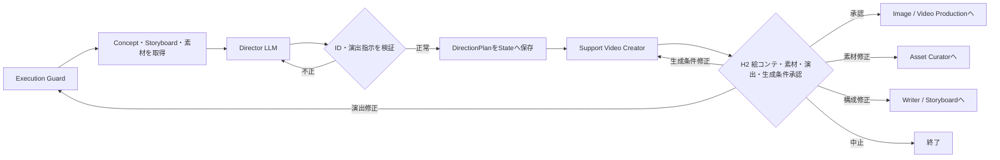

# Phase 05: Director

## 目的

承認済みの`CreativeConcept`、`Storyboard`、`AssetManifest`を、
生成バックエンドに依存しないカット別の演出指示`DirectionPlan`へ変換する。

このフェーズでは、各カットの使用素材、生成プロンプト、カメラワーク、
動きの強さと演出意図を具体化する。

修正後はDirectorの後にSupport Video Creatorを置き、技術パラメータへ
変換してからH2で絵コンテ、素材、演出、生成条件をまとめて確認する。

## 修正後の確定仕様

状態: `implemented`（技術パラメータ変換はPhase 05.5で実装予定）

- Directorは`positive_prompt`、`negative_prompt`、具体的な`camera_motion`、
  `motion_intensity`、`rationale`を決める。
- 各カットでCreative Directorの`camera_intent`との関係を説明し、逸脱する場合は
  `deviation_reason`を必須にする。
- `width`、`height`、`frames`、`steps`、`fps`、ComfyUIノードIDなどは決めず、
  Phase 05.5 Support Video Creatorへ委譲する。
- 修正ループでは`target_cut_id`を指定し、対象カットだけを再生成する。
- 承認済みの他カットはロックし、全`DirectionPlan`の意図しない変化を防ぐ。
- H2の修正先は内容に応じてDirector、Support Video Creator、Asset Curator、
  Writer / Storyboardへ振り分ける。

## 修正後の処理フロー

現在の実装は`Director -> H2 -> Phase 06`である。次の図はPhase 05.5と
修正種別ごとの差し戻しを追加した確定設計を示す。



## 最初に渡す情報

### プロジェクト指定

- 応募する賞
- テーマ
- 目標尺

### 承認済みCreativeConcept

Creative Directorが決定した次の情報を渡す。

- コンセプト
- トーン
- 色彩
- カメラの全体方針
- 映像全体の一貫性
- 音響方針

### 承認済みStoryboard

各カットの次の情報を渡す。

```json
{
  "id": 4,
  "name": "光のクライマックス",
  "scene": "皿倉山から見た壮大な北九州の夜景",
  "narration": "北九州、その輝きは夜空へ続く。",
  "seconds": 8,
  "media_requirement": "video_required",
  "time_of_day": "night",
  "visual_role": "climax",
  "location": "皿倉山",
  "subject": "北九州の夜景"
}
```

### 承認済みAssetManifest

各カットへ選定された素材情報を渡す。

```json
{
  "cut_id": 4,
  "primary": {
    "asset_id": "asset-004",
    "title": "皿倉山夜景05",
    "local_path": "assets_dl/皿倉山夜景05-scaled.jpg",
    "source_url": "画像URL",
    "selection_reason": "最終夜景カットに適している"
  },
  "alternatives": []
}
```

生成プロファイルやComfyUIノード情報はDirectorへ渡さない。これらは
Phase 05.5 Support Video Creatorが扱う。

再実行の場合は、人間が前回入力した`review_feedback`も渡す。

## このフェーズの処理

1. Execution Guardがフェーズ実行回数、全体実行数、経過時間を確認する
2. `CreativeConcept`、`Storyboard`、`AssetManifest`を取得する
3. Directorの役割プロンプトと入力情報をLLMへ渡す
4. LLMがカット別の素材、プロンプト、カメラワーク、強度、理由を決定する
5. カットIDと、そのカットへ割り当て済みの素材IDだけを使っているか検証する
6. 全Storyboardカットに1つずつShotがあるか検証する
7. `target_cut_id`がある場合は対象だけ更新し、他のShotをロックする
8. 結果とLLM実行情報をLangGraphのStateへ保存する
9. H2 Review Gateで人間の判断を待つ

現在の役割プロンプトでは、北九州の実在する建築、地形、街並みを維持し、
Image-to-Videoに適した具体的な長文プロンプトと、抑制されたカメラ移動を
作るよう指示している。

LLM出力の内部修正試行は、現在は初回を含め最大3回。

## 次のステップへ渡す情報

現在のLLM出力形式は次の`DirectionPlan`。

```json
{
  "shots": [
    {
      "cut_id": 4,
      "asset_id": "asset-004",
      "positive_prompt": "皿倉山から見た北九州の夜景。元の建築、地形、港、道路を維持し、街の光だけが穏やかに揺れる。カメラは安定した緩やかな前進を行う。",
      "negative_prompt": "distorted architecture, flickering, motion smear",
      "camera_motion": "slow stable push-in",
      "motion_intensity": "subtle",
      "rationale": "夜景の広がりを保ちながら奥行きを加えるため",
      "camera_intent_alignment": "荘厳で安定した終盤の体験に一致",
      "deviation_reason": null
    }
  ],
  "continuity_checks": [
    "昼から夜へ自然に色温度を変化させる",
    "建築物と地形を変形させない",
    "カメラ移動を不自然に切り替えない"
  ]
}
```

検証後はStoryboardと素材の実値を結合する。

```json
{
  "id": 4,
  "scene": "皿倉山から見た壮大な北九州の夜景",
  "seconds": 8,
  "media_requirement": "video_required",
  "asset": {
    "asset_id": "asset-004",
    "local_path": "assets_dl/皿倉山夜景05-scaled.jpg"
  },
  "positive_prompt": "生成用の具体的な指示",
  "negative_prompt": "避ける表現",
  "camera_motion": "slow stable push-in",
  "motion_intensity": "subtle",
  "rationale": "このカメラワークを選択した理由",
  "camera_intent_alignment": "全体方針との関係",
  "deviation_reason": null
}
```

Phase 05.5はこのShot一覧を使い、生成バックエンド向け技術パラメータへ変換する。

## 自動検証

現在、次を検証する。

- `CreativeConcept`、`Storyboard`、`AssetSelection`が存在する
- LLMが返したカットIDがStoryboardに存在する
- LLMが返した素材IDが対象カットのPrimaryまたはAlternativeに存在する
- Storyboardの全カットに1つずつShotがある
- ShotのカットIDが重複していない

1カットでもShotが不足している場合は`DirectionPlan`をエラーにする。

## 人間確認

現在は`manual`モードなので、Directorの直後にあるH2
「絵コンテ・素材・演出承認」で必ず停止する。

H2はComfyUIで時間のかかる生成を開始する直前の確認ポイント。

### 選択できる操作

- `approve`: 内容を承認してImage / Video Productionへ進む
- `retry_with_feedback`: 修正指示を渡してDirectorを再実行する
- `abort`: ワークフローを終了する

### 現在、修正指示できる範囲

- カットと素材の組み合わせ
- Positive Prompt
- Negative Prompt
- カット別のカメラワーク
- 動きの強さ
- カメラワークを選んだ理由
- Creative Directorの`camera_intent`との関係
- 建物や地形を維持する指示
- 色、動き、演出の一貫性

例:

```text
Cut 1のカメラ移動をさらに弱くしてください。
Cut 4は皿倉山夜景を使い、街の光だけが静かに揺れる表現にしてください。
Cut 4のカメラワークを選んだ理由も説明してください。
```

`target_cut_id`付きの修正では、そのカットだけをLLMへ再生成させ、
承認済みの他カットを固定する。対象IDがない場合は全体を再生成する。

### 現在、修正指示だけでは変更できないもの

- Storyboardのカット内容や秒数
- 新しい素材の追加・ダウンロード
- ProjectBriefやCreativeConcept
- ComfyUI APIワークフロー本体
- 使用するLTXモデル
- 現在Schemaにない詳細なサンプラー設定
- Review Policyや実行上限などのシステム設定

H2では`correction_type`に応じ、`asset`はAsset Curator、
`storyboard`はWriter / Storyboard、`concept`はCreative Director、
`direction`はDirectorへ戻す。

## 現在の注意点

- CreativeConceptとの意味的な矛盾をコードで検証していない
- ローカル画像の存在確認は次のProductionで行う
- プロンプトの長さや品質を自動評価していない
- 一度に実生成する動画は現在最大1カット

## エラー時

`CreativeConcept`、`Storyboard`、`AssetSelection`のいずれかが存在しない場合は
実行せず、結果を`error`としてH2 Review Gateへ渡す。

存在しないカットIDや、そのカットへ未割当の素材IDをLLMが返した場合は
JSON変換を失敗させ、LLMへ修正を依頼する。

全カット分のShotがない場合もエラーにする。
