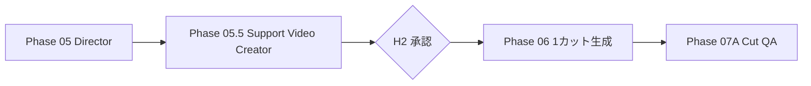

# Phase 05.5 / 06: Support Video Creator & Image / Video Production

## 状態

`implemented`

## 目的

Directorの演出判断を変えず、各カットを生成バックエンドが実行できる
`ProductionRequest`へ変換し、キューから1カットずつ生成する。



## Phase 05.5の入力と出力

入力は、Storyboardの秒数、Asset Curatorのローカル画像、Directorの
Positive / Negative Prompt、カメラ指示、Production Profileである。

出力例:

```json
{
  "cut_id": 1,
  "backend": "comfy",
  "image_path": "assets_dl/example.jpg",
  "positive_prompt": "...",
  "negative_prompt": "...",
  "width": 576,
  "height": 384,
  "frames": 121,
  "steps": 20,
  "fps": 24,
  "seed": 123456,
  "requested_seconds": 5,
  "actual_seconds": 5.0417
}
```

LTXのフレーム制約`8n+1`へ自動的に丸める。モデル上限を超える場合は、
内容を勝手に分割せずBlocking Issueとして上流へ返す。

## Phase 06の処理

- `production_queue`から未承認の1カットを選ぶ
- `backend: comfy`ならComfyUI APIへ画像とWorkflowを送る
- `backend: mock`ならテスト可能な実MP4をFFmpegで作る
- 出力、設定、seed、所要時間、試行番号をArtifactへ記録する
- 生成後は必ずPhase 07Aへ進む

合格済みカットは`approved_cut_ids`へロックされ、対象カットの修正時に
他のカットを再生成しない。

## ループ上限

- `max_generation_attempts_per_cut`: 1カット当たりの上限
- `max_total_production_attempts`: 全カット合計の上限
- `phase_retry_overrides.image_video_production`: LangGraphノード実行上限

3つを別々に検査し、無限生成を防止する。

## 人間が修正できる範囲

H2では、コンセプト、Storyboard、素材、演出、生成パラメータの修正先を
指定できる。Phase 06自体は創造的な判断を行わず、生成Requestを実行する。

## 実ComfyUIの条件

- ComfyUI Desktopが起動している
- `production.backend: comfy`
- `workflows/ltx_i2v_api.json`がAPI形式
- Workflow入力マッピングが解決できる
- 各カットの入力画像がローカルに存在する

`config.yaml`は安全な`mock`、`config_llm.yaml`は実行用の`comfy`を既定とする。
