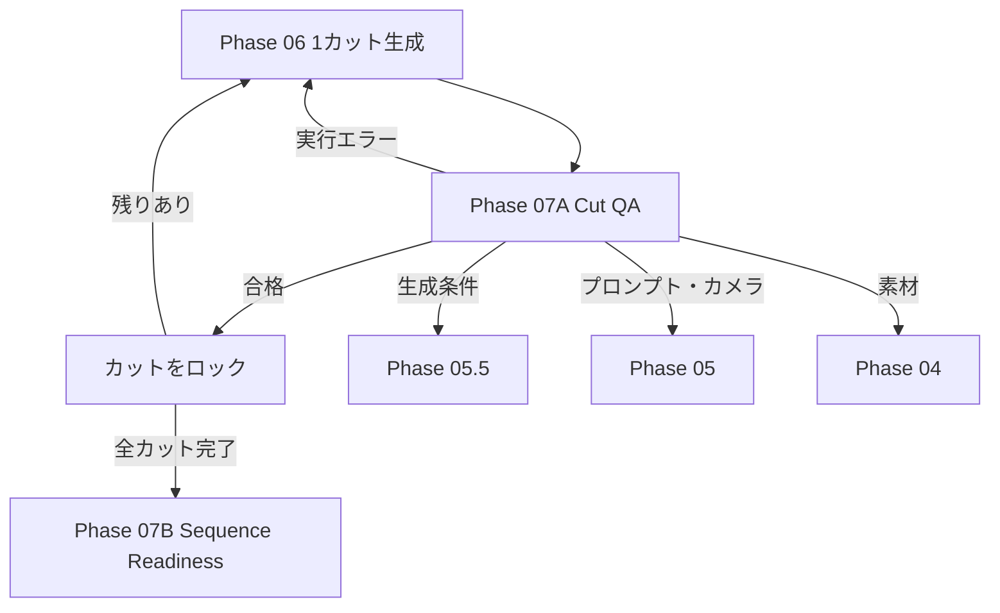

# Phase 07: Cut QA & Sequence Readiness QA

## 状態

`technical_qa_implemented / semantic_vlm_optional`

## 目的

Phase 07を、生成直後のカット検査と、全カット承認後の編集準備検査へ分ける。

## Phase 07Aで実装済みの検査

- ファイル存在とサイズ
- FFprobeによる実尺、解像度、FPS、Codecの取得
- 動画全体のデコード検査
- Requestと実尺・解像度の比較
- 先頭・中央・終端付近の代表フレーム抽出
- カット単位のReview Gate
- 問題分類に応じた差し戻し
- 合格カットのロック

問題分類:

| 分類 | 差し戻し先 |
|---|---|
| `runtime_transient` | Phase 06 |
| `generation_parameters` | Phase 05.5 |
| `prompt_or_motion` | Phase 05 Director |
| `source_asset` | Phase 04 |
| `pass` | 次のカット |

## VLM評価

代表フレームと証拠ファイルは作成済みだが、VLM Providerはまだ設定していない。
したがって現在の自動合格は技術検査に対する合格であり、映像内容、ちらつき、
建築物の変形、プロンプト適合などの意味的評価を行ったとは記録しない。

本番では`cut_visual_qa: always`のまま人間が代表フレームと動画を確認するか、
後からVLM Adapterを接続する。

## Phase 07B

全Storyboardカットが承認済みか、合計秒数がPhase 01の目標尺と一致するかを
決定論的に検査する。完成動画のテンポや接続品質はPhase 08後のH3または
Phase 09で確認する。
