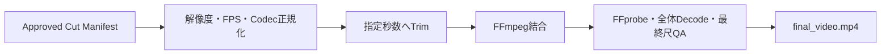

# Phase 08: Post Production

## 状態

`video_assembly_implemented / audio_and_subtitle_not_configured`

## 目的

Phase 07で承認された全カットをStoryboard順・指定秒数どおりに正規化し、
1本の提出候補MP4へ結合する。

## 実装済みフロー



- 未承認カットや欠落ファイルを拒否
- `video_required`へ静止画を割り当てることを拒否
- 動画が指定尺より短い場合は上流へ差し戻す
- 解像度、FPS、H.264、YUV420Pへ統一
- Storyboard順にHard Cutで結合
- 最終MP4を全体デコード
- Phase 01の目標尺との誤差を検査

生成物:

```text
work/post/
├── final_video.mp4
├── edit_manifest.json
├── ffmpeg_commands.json
├── post_production_plan.json
├── technical_report.json
└── normalized/
```

## 尺の責務

- Phase 01: 全体尺
- Phase 03: 各カットへの配分
- Phase 05.5: 秒数をframesへ変換
- Phase 08: 指定尺どおりに結合

Phase 08が都合よく尺を再決定することはない。

## 現時点の非対象

字幕、ナレーション、BGM、ACE-Step連携、音声ミックスは、音源・台本・
音声モデルの実設定がまだないため`not_configured`としてManifestへ明示する。
映像だけの完成MP4は生成できる。
