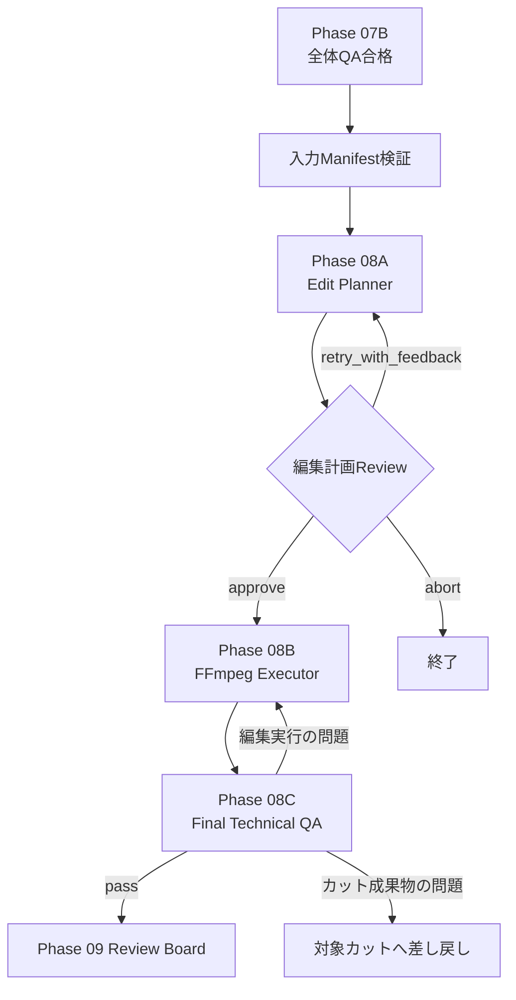

# Phase 08 Revision Backlog

> 状態: FFmpeg映像結合とTechnical QAは実装済み。
> 音声、字幕、BGMは素材・Provider未設定。
> 現行仕様は[Phase 08](../phases/PHASE_08_POST_PRODUCTION.md)を参照。

現在の編集計画生成だけのPost Productionを、
承認済みカットから最終MP4を作成・検証できる工程へ変更する。

## 設計原則

状態: `pending`

Phase 08は尺を決めない。

- 作品全体の目標尺はPhase 01が決定する
- カット別秒数はPhase 03が決定する
- Support Video Creatorが秒数を生成可能なframes / fpsへ変換する
- Phase 06・07が使用可能なカット成果物を確定する
- Phase 08は承認済みの秒数と順番を守って一本に結合する

LLMが`final_duration_seconds`を自由に変更できないよう、
ProjectとStoryboardから計算した値をコード側で検証する。

## 目標構成



## 入力Manifest

状態: `pending`

Phase 08は、Phase 07で承認された成果物だけを受け取る。

```json
{
  "target_duration_seconds": 30,
  "timeline": [
    {
      "order": 1,
      "cut_id": 1,
      "storyboard_seconds": 4,
      "artifact_kind": "video",
      "artifact_path": "work/production/cut_01.mp4",
      "qa_status": "approved",
      "media_requirement": "video_required"
    }
  ]
}
```

### 必須検証

- 全Storyboardカットが存在する
- `order`が重複していない
- `cut_id`が重複していない
- 全カットがPhase 07で承認済み
- 各成果物ファイルが存在する
- 各カット秒数の合計がPhase 01の目標尺と一致する
- `video_required`に動画が割り当てられている
- Draft用フォールバックを本番成果物として扱っていない

## Media Requirement

状態: `pending`

現在の`media_strategy`を、最終成果物の要件が分かる形へ明確化する。

- `video_required`: 合格した生成動画が必須
- `still_allowed`: 人間が承認すれば静止画利用可能
- `still_preferred`: 意図的に静止画として見せる

通常の本番方針では、動画化するカットを`video_required`にする。

### ComfyUI入力画像

Image-to-Videoの元画像。最終タイムラインの静止画指定とは別物。

### 意図的な静止画

`still_allowed`または`still_preferred`として上流で承認されたもの。
Phase 08で指定秒数の動画へ変換し、必要なら緩いパン・ズームを適用する。

### Draft用フォールバック

生成未完了時に構成確認用としてのみ使用する。

```json
{
  "artifact_kind": "source_image_fallback",
  "usage": "draft_only",
  "approved_for_final": false
}
```

`video_required`カットのフォールバックはFinal Technical QAを通過させない。

## Phase 08A: Edit Planner

状態: `pending`

Storyboardの順序と秒数を固定したまま、実行可能な編集Manifestを作る。

LLMが提案できる範囲:

- ハードカットまたは短いトランジション
- 字幕の表示位置とスタイル
- ナレーション配置
- BGMの開始、終了、音量変化
- 静止画許可カットのパン・ズーム
- 最終タイトルの表示

LLMが変更できない範囲:

- Phase 01の目標尺
- Phase 03のカット順
- Phase 03のカット秒数
- 承認済み成果物のCut ID
- `video_required`を静止画へ変更すること

### 目標出力

```json
{
  "timeline": [
    {
      "order": 1,
      "cut_id": 1,
      "source": "work/production/cut_01.mp4",
      "start_seconds": 0,
      "duration_seconds": 4,
      "transition_to_next": "hard_cut"
    }
  ],
  "video_spec": {
    "width": 1920,
    "height": 1080,
    "fps": 24,
    "container": "mp4",
    "video_codec": "h264"
  },
  "subtitle_plan": {},
  "narration_plan": {},
  "bgm_plan": {}
}
```

最終解像度、アスペクト比、FPS、コーデックはAGEWEC提出要件を確認後、
設定ファイルで固定する。

## 動画尺の不一致

状態: `pending`

Phase 08は尺の不一致を発見した場合、原則として上流へ差し戻す。

| 状況 | 動作 |
|---|---|
| 動画が指定尺より長い | 承認された範囲でTrim |
| 動画がわずかに短い | 許容値内なら短い終端保持を提案 |
| 動画が大幅に短い | Support Video CreatorまたはPhase 06へ戻す |
| 対応可能な生成尺を超える | Support Video Creatorが複数Segmentへ分割 |
| 意図的な静止画 | 指定秒数で動画化 |
| Draftフォールバック | Draft出力のみ許可 |

終端保持やTrimを無条件に行わず、許容秒数を設定し、
最終的な`actual_duration_seconds`を記録する。

## Phase 08B: FFmpeg Executor

状態: `pending`

Edit PlannerのManifestを決定論的に実行する。

### 最小実装

1. ffprobeで入力素材を検査する
2. 各素材を共通解像度・FPS・ピクセル形式へ正規化する
3. 動画を承認済み尺へTrimする
4. 意図的な静止画を指定秒数の動画へ変換する
5. Storyboard順にカットを結合する
6. 字幕を追加する
7. MP4へエンコードする
8. 実行コマンドとログを保存する

最初はハードカットを基本とする。
クロスフェードはタイムライン尺への影響を計算できるようになってから追加する。

### 将来追加

- ACE-StepによるBGM生成
- TTSによるナレーション生成
- BGMとナレーションのミックス
- Loudness正規化
- 自動ダッキング
- カラー調整
- 複雑なトランジション

## Phase 08C: Final Technical QA

状態: `pending`

完成MP4をffprobeおよびデコード検査する。

### 検査項目

- ファイルが存在する
- ファイルサイズが0ではない
- 最後までデコードできる
- 実測尺
- 目標尺との差
- width / height
- アスペクト比
- FPS
- コンテナ
- video codec
- audio codec
- 音声ストリームの有無
- 字幕または焼き込み結果

### 目標出力

```json
{
  "status": "pass",
  "output_path": "work/post/final_video.mp4",
  "expected_duration_seconds": 30,
  "actual_duration_seconds": 30.0,
  "duration_delta_seconds": 0.0,
  "width": 1920,
  "height": 1080,
  "fps": 24,
  "video_codec": "h264",
  "issues": []
}
```

## 成果物

状態: `pending`

```text
work/post/final_video.mp4
work/post/post_production_plan.json
work/post/edit_manifest.json
work/post/ffmpeg_commands.json
work/post/ffmpeg.log
work/post/technical_report.json
```

Phase 09 Review Boardには、編集計画ではなく
`final_video.mp4`とTechnical QA結果を渡す。

## 人間確認

状態: `pending`

### Edit Plan Review

`manual`ではFFmpeg実行前に次を確認できる。

- カット順
- 上流で決定済みの秒数
- 使用成果物
- トランジション
- 字幕
- ナレーション
- BGM
- 最終出力仕様

### Final Output Review

完成動画の内容評価はPhase 09 Review Boardおよび最終提出承認で行う。

FFmpegの技術的失敗だけで人間を毎回止めず、
自動修正可能な場合はPhase 08内で上限付き再実行する。

## 差し戻し

| 問題 | 戻り先 |
|---|---|
| FFmpegコマンドまたはエンコード問題 | Phase 08B |
| 字幕、音量、結合順の問題 | Phase 08A |
| 実動画の尺不足 | Support Video Creator / Phase 06 |
| 特定カットの映像破綻 | Phase 07A |
| プロンプト、演出問題 | Phase 05の対象カット |
| 元画像問題 | Phase 04の対象カット |
| 全体構成問題 | Phase 07BまたはDirector |

対象カット以外の合格済み成果物は保持する。

## 実行上限

状態: `pending`

```yaml
execution_limits:
  max_post_plan_revisions: 2
  max_ffmpeg_attempts: 2
  max_final_technical_qa_attempts: 2
```

上限到達時は人間確認へ切り替える。

## 実装順序

1. 最終出力仕様を設定ファイルへ追加
2. Storyboard由来のTimeline Manifest Schemaを追加
3. 承認済み成果物とMedia Requirementを検証
4. Edit Plannerが秒数と順序を変更できない検証を追加
5. ffprobe入力検査を追加
6. 静止画・動画の正規化を実装
7. ハードカットによるFFmpeg結合を実装
8. 最終MP4出力を実装
9. Final Technical QAを実装
10. 字幕を実装
11. ACE-Step BGMとTTSナレーションを段階的に追加
12. Phase 09へ完成MP4を渡す

## 最小完成条件

- Phase 01とPhase 03の尺を変更しない
- Phase 07で承認された成果物だけを使用する
- `video_required`にDraft静止画を使用しない
- 動画・許可された静止画を共通仕様へ変換できる
- Storyboard順に結合できる
- 目標尺の最終MP4を出力できる
- ffprobeで完成動画を検証できる
- 使用素材、FFmpegコマンド、検査結果を記録できる
