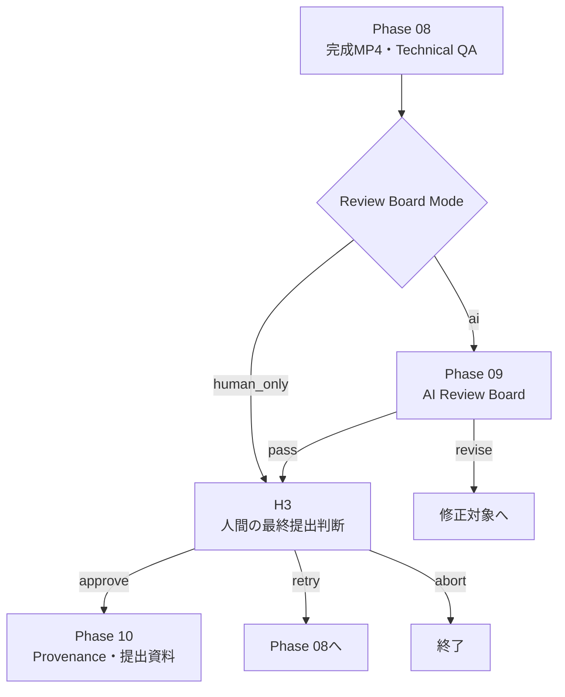

# Phase 09 Revision Backlog

> 状態: `ai / human_only`切替、H3強制人間確認、技術QA連動を実装済み。
> 現行仕様は[Phase 09](../phases/PHASE_09_REVIEW_BOARD.md)を参照。

完成動画をEvidence付きで総合評価できるReview Boardを実装しつつ、
締切時にはAI審査を安全にスキップして人間が最終判断できる構成へ変更する。

## 最優先: Human-only Mode

状態: `pending`

Phase 09のAI Review Boardを実行せず、Phase 08の完成動画から
H3の人間確認へ直接進む`human_only`モードを追加する。

```yaml
review_board:
  mode: human_only # ai / human_only

final_submission:
  require_human: true
```

### Mode

- `ai`: Phase 09のAI審査を実行し、`pass`ならH3へ進む
- `human_only`: AI審査をスキップし、H3へ直接進む

提出用の`human_only`ではH3を省略しない。

### 目標フロー



## Skip記録

状態: `pending`

AI審査をスキップしても、Phase自体を履歴から消さない。
次の結果をStateとProvenanceへ保存する。

```json
{
  "phase": "review_board",
  "status": "skipped",
  "mode": "human_only",
  "reason": "submission deadline priority",
  "final_decision_required": true,
  "artifacts": [],
  "blocking_issues": [],
  "warnings": [
    "AI Review Board was skipped; human final review is mandatory."
  ]
}
```

保存する情報:

- スキップ日時
- Run ID
- 選択したMode
- スキップ理由
- 設定値
- 最終判断を行った人間
- H3の承認、修正、中止

## `--auto`時の安全要件

状態: `pending`

現在のCLIは`--auto`で通常のReview Gateを自動承認する。

`final_submission.require_human: true`の場合は、
`--auto`でもH3を自動承認してはいけない。

```text
if final_submission.require_human:
    H3では必ずinterruptする
else:
    Review Policyに従う
```

H3のPayloadへ次を追加する。

- 完成動画パス
- Final Technical QA
- 未解決のWarning
- AI Review Boardの実行有無
- AI審査をスキップした理由

## H3で人間が確認する内容

状態: `pending`

- `final_video.mp4`
- 目標尺と実測尺
- 解像度
- FPS
- コーデック
- 音声の有無
- Final Technical QA結果
- 未解決のWarning
- 使用カット一覧
- 字幕、ナレーション、BGMの有無
- AI Review Boardの判定、またはスキップ記録

### 人間が選べる操作

- `approve`: 提出可能としてPhase 10へ進む
- `retry_with_feedback`: Phase 08へ戻す
- `abort`: 終了

将来は、Feedback分類に応じて対象カットやDirectorへ戻せるようにする。

## AI Review Board

状態: `pending`

時間がある場合に使用する`ai`モードを実装する。

1つのAIへ30秒動画全編を必須入力にせず、
複数のEvidenceを統合して審査する。

### 入力Evidence

- `final_video.mp4`のパス
- Final Technical QA
- Project Briefと成功基準
- Creative Concept
- Storyboard
- Asset Manifest
- DirectorのDirection Plan
- Phase 07AのカットQA
- Phase 07Bの全体QA
- Phase 08 Edit Manifest
- 完成動画の代表フレーム
- コンタクトシート
- 字幕
- ナレーション原稿または文字起こし
- BGMと音声のメタデータ

完成動画を直接処理できるVLMがない場合は、
代表フレームと既存QAを使用し、評価できない項目を明示する。

## 評価の分割

状態: `pending`

単一LLMの印象だけで判定せず、次を分ける。

### 決定論的評価

- 尺
- 解像度
- FPS
- コーデック
- ファイル破損
- 必須成果物
- 全カットQA完了
- Blocking Issueの有無

### 視覚・内容評価

- 北九州らしさ
- 応募テーマとの一致
- コンセプトの一貫性
- ストーリー構成
- 昼から夜への流れ
- 最終夜景の訴求力
- 字幕と映像の一致

### 人間評価

- 動画全体の体感的なテンポ
- 細かな映像破綻
- 音楽と映像の同期
- 主観的な魅力
- 実際に提出してよいか

## 固定Rubric

状態: `pending`

Review Boardが毎回異なる項目を作らないよう、
Project Briefの成功基準と応募要件からRubricを固定する。

```json
{
  "criteria": [
    {
      "id": "theme_alignment",
      "label": "応募テーマとの適合",
      "weight": 0.15,
      "score": 4.0,
      "evidence": [
        "Project BriefとStoryboardの対応"
      ],
      "recommendation": ""
    },
    {
      "id": "visual_impact",
      "label": "映像の訴求力",
      "weight": 0.2,
      "score": 4.2,
      "evidence": [
        "最終夜景カット"
      ],
      "recommendation": ""
    }
  ],
  "weighted_score": 4.1,
  "blocking_issues": [],
  "verdict": "pass",
  "confidence": 0.87
}
```

### 必須項目

- Rubric ID
- 表示名
- Weight
- 0〜5点のScore
- 根拠Evidence
- Recommendation

Weight合計と加重平均をコードで検証する。

## Pass条件

状態: `pending`

Pass条件をLLMへ完全に任せず、設定可能な規則として持つ。

```yaml
review_board:
  mode: human_only
  pass_threshold: 3.8
  minimum_criterion_score: 3.0
  require_no_blocking_issues: true
```

判定案:

- 加重平均が`pass_threshold`以上
- すべての必須項目が`minimum_criterion_score`以上
- Blocking Issueが0件
- Final Technical QAがpass
- 必須カットのVisual QAがpass

条件を満たさない場合、LLMが`pass`を返してもコード側で`revise`へ変更する。

決定論的フォールバックも同じPass条件を使用する。

## 問題別の差し戻し

状態: `pending`

| 問題 | Route | 修正範囲 |
|---|---|---|
| 字幕、BGM、音量、結合 | Phase 08 | Edit PlanまたはFFmpeg |
| 完成動画の技術問題 | Phase 08C / 08B | 技術処理のみ |
| 特定カットの映像破綻 | Phase 07A | 対象カット |
| 生成設定 | Support Video Creator | 対象Request |
| プロンプト、カメラ、演出 | Phase 05 | 対象カット |
| 元画像 | Phase 04 | 対象カット |
| カット間の流れ | Phase 07B / Phase 05 | Cut Range |
| コンセプト全体 | Phase 02 | 全体 |

合格済みで問題と無関係なカットは保持する。

## Review Gateの整理

状態: `pending`

現在はPhase 09のReview GateとH3が連続する。

修正後:

- AIが`pass`: H3へ進む
- AIが`revise`かつRouteが明確: 上限内で自動差し戻し
- AIが低信頼度またはRoute不明: 人間確認
- `human_only`: AIを実行せずH3へ
- H3: 最終的な提出判断

Phase 09直後の人間Review Gateは`on_exception`を標準とし、
H3との重複を減らす。

## 実行上限

状態: `pending`

```yaml
execution_limits:
  max_review_board_attempts: 2
  max_review_board_revision_loops: 2
```

上限到達時は自動差し戻しを停止し、H3または専用の人間確認へ切り替える。

## 締切前の最小実装

1. `review_board.mode`を追加
2. `human_only` Routerを追加
3. AIスキップ結果をStateへ保存
4. H3へ完成MP4とTechnical QAを表示
5. `require_human: true`を追加
6. `--auto`でもH3を強制interrupt
7. H3の承認、修正、中止をProvenanceへ保存

高度なVLM審査、固定Rubric、問題別Routeは提出後でもよい。

## 実装順序

1. Human-only ModeとH3強制確認
2. Skip記録とProvenance
3. 完成MP4・Technical QAのH3表示
4. Final Technical QAに基づくBlocking Rule
5. 固定Rubric Schema
6. Pass条件のコード検証
7. 代表フレーム・コンタクトシート入力
8. Evidence付きAI Review Board
9. 問題別Route
10. UIで採点、Evidence、修正理由を表示

## 最小完成条件

- `human_only`でAI Review Boardを実行せずH3へ進める
- AIをスキップした事実と理由を記録できる
- `--auto`でもH3を自動承認しない
- 人間が完成MP4とTechnical QAを確認できる
- 人間が承認、Phase 08へ差し戻し、中止を選べる
- 最終判断をProvenanceへ保存できる
- `ai`モードへ後から切り替えられる
