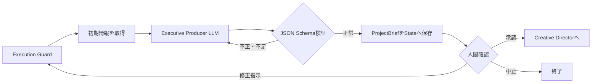

# Phase 01: Executive Producer

## 目的

プロジェクト開始時の指定を、後続エージェントが共通の判断基準として使える
`ProjectBrief`（制作要件書）へ変換する。

このフェーズではコンセプト、台本、素材、動画そのものは作らない。

## 修正後の確定仕様

状態: `design_confirmed / implementation_partial`

- 最初に入力した`target_duration_seconds`を、作品全体の正式な目標尺として固定する。
- Executive ProducerのLLMは尺を新しく決めるのではなく、構造化入力を`ProjectBrief`へ正確に反映する。
- Writer / Storyboardはこの尺を各カットへ配分し、Post Productionは独自判断で変更しない。
- 秒数、応募部門、用途などのプロジェクト条件を変更する場合は、自由記述の再生成指示だけに依存せず、将来は構造化された`project_updates`として更新する。
- 次工程以降には元の`project`と承認済み`ProjectBrief`の両方を渡し、重要条件を追跡可能にする。

## 処理フロー



## 最初に渡す情報

### プロジェクト指定

`config_llm.yaml`の`project`をLangGraphのStateへ読み込んで渡す。

```yaml
project:
  target_award: 夜景賞
  theme: 北九州の魅力を世界へ
  target_duration_seconds: 30
```

- `target_award`: 応募する賞・部門
- `theme`: 動画で伝える主題
- `target_duration_seconds`: 目標尺。後続のStoryboardもこの値を使用する

### システム情報

```json
{
  "orchestrator": "LangGraph",
  "media_backend": "comfy",
  "review_modes": ["always", "on_exception", "never"]
}
```

再実行の場合は、人間が前回入力した`review_feedback`も渡す。

## このフェーズの処理

1. Execution Guardがフェーズ実行回数、全体実行数、経過時間を確認する
2. 役割プロンプトと入力情報をLM StudioのLLMへ渡す
3. LLMが制作目的、視聴者、成果物、制約、成功基準を作成する
4. 出力を`ProjectBrief`のJSON Schemaで検証する
5. JSON不正や必須項目不足の場合、LLMへ修正を依頼する
6. 正常な結果とLLM実行情報をLangGraphのStateへ保存する
7. Review Gateで人間の判断を待つ

LLM出力の内部修正試行は、現在は初回を含め最大3回。

## 次のステップへ渡す情報

形式は次の`ProjectBrief` JSON。

```json
{
  "objective": "この動画で達成する目的",
  "target_award": "応募する賞",
  "audience": "想定視聴者",
  "deliverable": "制作する成果物",
  "constraints": [
    "守るべき制約"
  ],
  "success_criteria": [
    "成功と判断する基準"
  ]
}
```

合わせて以下もStateへ保存する。

- ステータス
- 要約
- 信頼度
- 使用したプロバイダとモデル
- トークン使用量
- LLM呼び出し回数
- 実行時間
- エラー・警告

Creative Directorは、元の`project`とこの`ProjectBrief`の両方を入力として使う。

## 人間確認

現在は`manual`モードなので、Executive Producerの直後で必ず停止する。

### 選択できる操作

- `approve`: 内容を承認してCreative Directorへ進む
- `retry_with_feedback`: 修正指示を渡して同じフェーズを再実行する
- `abort`: ワークフローを終了する

### 現在、修正指示できる範囲

- 目的の表現
- 想定視聴者
- 成果物の説明
- 制約
- 成功基準
- 情報の具体性や粒度

例:

```text
対象視聴者を海外の20〜30代観光客へ絞り、
成功基準をより測定可能な内容にしてください。
```

### 現在、修正指示だけでは変更できないもの

- `target_duration_seconds`
- `target_award`
- `theme`
- Review Policyや実行上限などのシステム設定

これらはプロジェクトの基準値であり、現在はワークフロー開始前に
`config_llm.yaml`で指定する。

例えばレビュー欄へ「40秒にして」と入力しても、正式な
`target_duration_seconds`は30秒のままであり、後続Storyboardも30秒を基準にする。

将来Review Gateからこれらを変更する場合は、文章フィードバックとは別に
`project_updates`のような構造化された設定更新処理が必要。

## エラー時

LLM接続失敗、JSON検証失敗、必須項目不足が解決しない場合は、結果を
`error`としてReview Gateへ渡す。人間は修正して再実行するか、中止できる。
