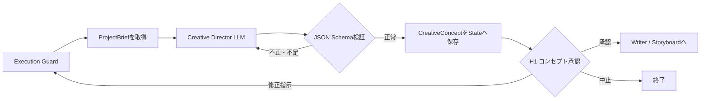

# Phase 02: Creative Director

## 目的

Executive Producerが作成・承認した`ProjectBrief`を、映像全体で統一して
使用する`CreativeConcept`へ変換する。

このフェーズではコンセプト、トーン、映像表現、音響方針を決めるが、
具体的な台本、カット、素材、生成プロンプトはまだ作らない。

## 修正後の確定仕様

状態: `design_confirmed / implementation_pending`

Creative Directorは具体的なカメラ移動を全カット分決めず、作品全体の
`camera_intent`を定義する。

```json
{
  "camera_intent": {
    "viewer_experience": "昼の活気から荘厳な夜景へ導く",
    "energy_curve": "active_to_calm",
    "stability": "mostly_stable",
    "continuity": "movement must connect naturally between cuts",
    "hard_constraints": [
      "avoid aggressive rotation",
      "preserve real architecture and geography"
    ]
  }
}
```

- Creative Directorは「視聴者にどう感じてほしいか」と全体の運動方針を決める。
- Directorは素材とカット内容を見て、具体的なカメラ移動を選ぶ。
- Directorは選択理由、全体方針との関係、意図的な逸脱理由を残す。
- H1ではコンセプト、トーン、`camera_intent`をまとめて承認する。
- 詳細は[Phase 05の修正案](./REVISION_BACKLOG_PHASE_05.md)を参照する。

## 処理フロー



## 最初に渡す情報

### プロジェクト指定

LangGraphのStateに保存されている元の`project`を渡す。

```yaml
project:
  target_award: 夜景賞
  theme: 北九州の魅力を世界へ
  target_duration_seconds: 30
```

- `target_award`: 応募する賞・部門
- `theme`: 動画で伝える主題
- `target_duration_seconds`: 目標尺

### 承認済みProjectBrief

Executive Producerが作成した次の情報を渡す。

```json
{
  "objective": "制作目的",
  "target_award": "夜景賞",
  "audience": "想定視聴者",
  "deliverable": "制作する成果物",
  "constraints": [
    "守るべき制約"
  ],
  "success_criteria": [
    "成功と判断する基準"
  ]
}
```

再実行の場合は、人間が前回入力した`review_feedback`も渡す。

## このフェーズの処理

1. Execution Guardがフェーズ実行回数、全体実行数、経過時間を確認する
2. `project`と承認済み`ProjectBrief`を取得する
3. Creative Directorの役割プロンプトと入力情報をLM StudioのLLMへ渡す
4. LLMが作品全体のクリエイティブコンセプトを作成する
5. 出力を`CreativeConcept`のJSON Schemaで検証する
6. JSON不正や必須項目不足の場合、LLMへ修正を依頼する
7. 正常な結果とLLM実行情報をLangGraphのStateへ保存する
8. H1 Review Gateで人間の判断を待つ

LLMには次の内容を決定させる。

- コンセプトタイトル
- 一文で表す作品の方向性
- トーン・雰囲気
- カラーパレット
- カメラ表現
- 全カットで守る連続性
- 音楽・音響の方向性
- コンセプト段階の成功基準

北九州らしさを残し、Executive Producerが承認した制約を変更しないよう
役割プロンプトで指示している。

LLM出力の内部修正試行は、現在は初回を含め最大3回。

## 次のステップへ渡す情報

形式は次の`CreativeConcept` JSON。

```json
{
  "title": "作品タイトル",
  "logline": "作品全体を一文で表したもの",
  "tone": [
    "cinematic",
    "hopeful"
  ],
  "visual_language": {
    "palette": [
      "deep blue",
      "warm amber"
    ],
    "camera": "ゆっくり安定したカメラ移動",
    "continuity_rule": "全編で青と琥珀色を維持する"
  },
  "audio_direction": "静かに始まり、後半で広がる音楽",
  "success_criteria": [
    "北九州らしさが一貫して伝わる"
  ]
}
```

合わせて以下もStateへ保存する。

- ステータス
- 要約
- 信頼度
- 使用したプロバイダとモデル
- トークン使用量
- LLM呼び出し回数
- 実行時間
- エラー・警告

Writer / Storyboardは次の3つを入力として使う。

- 元の`project`
- Executive Producerの`ProjectBrief`
- Creative Directorの`CreativeConcept`

## 人間確認

現在は`manual`モードなので、Creative Directorの直後にある
H1「コンセプト承認」で必ず停止する。

### 選択できる操作

- `approve`: 内容を承認してWriter / Storyboardへ進む
- `retry_with_feedback`: 修正指示を渡して同じフェーズを再実行する
- `abort`: ワークフローを終了する

### 現在、修正指示できる範囲

- タイトル
- コンセプトと訴求内容
- トーン・雰囲気
- カラーパレット
- カメラ表現
- 映像全体の一貫性
- 音楽・音響の方向性
- コンセプト段階の成功基準
- 情報の具体性や粒度

例:

```text
工業都市の力強さよりも、皿倉山から見た夜景の美しさを中心にしてください。
色は青を基調にしつつ、街灯の暖色をアクセントにしてください。
```

修正指示を受けると、特定フィールドだけを直接編集するのではなく、
LLMが`CreativeConcept`全体を再生成する。

### 現在、修正指示だけでは変更できないもの

- `target_duration_seconds`
- `target_award`
- 元の`theme`
- Executive Producerの`ProjectBrief`そのもの
- 具体的な台本やカット構成
- 使用する素材
- ComfyUIの生成設定
- Review Policyや実行上限などのシステム設定

Creative DirectorのReview Gateから、Executive Producerへ直接戻る経路も
現在は実装されていない。ProjectBriefから変更する必要がある場合は、
ワークフローを中止して開始し直すか、将来的に前工程へ戻る機能を追加する。

## 現在の注意点

「承認済みの制約を変更しない」という指示は役割プロンプトに含まれているが、
現在のコードは`ProjectBrief`との意味的な完全一致までは検査していない。

JSON形式と必須フィールドは自動検証する。コンセプトがProjectBriefと
矛盾していないかは、現在はH1の人間確認でも判断する設計。

`audio_direction`は音楽・音響の方針であり、このフェーズでは音声やBGMを
実際には生成しない。

## エラー時

承認済み`ProjectBrief`が存在しない場合は実行せず、結果を`error`として
Review Gateへ渡す。

LLM接続失敗、JSON検証失敗、必須項目不足が解決しない場合も`error`として
Review Gateへ渡し、人間は修正して再実行するか、中止できる。
