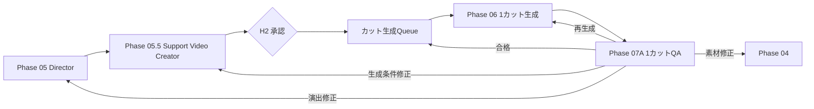
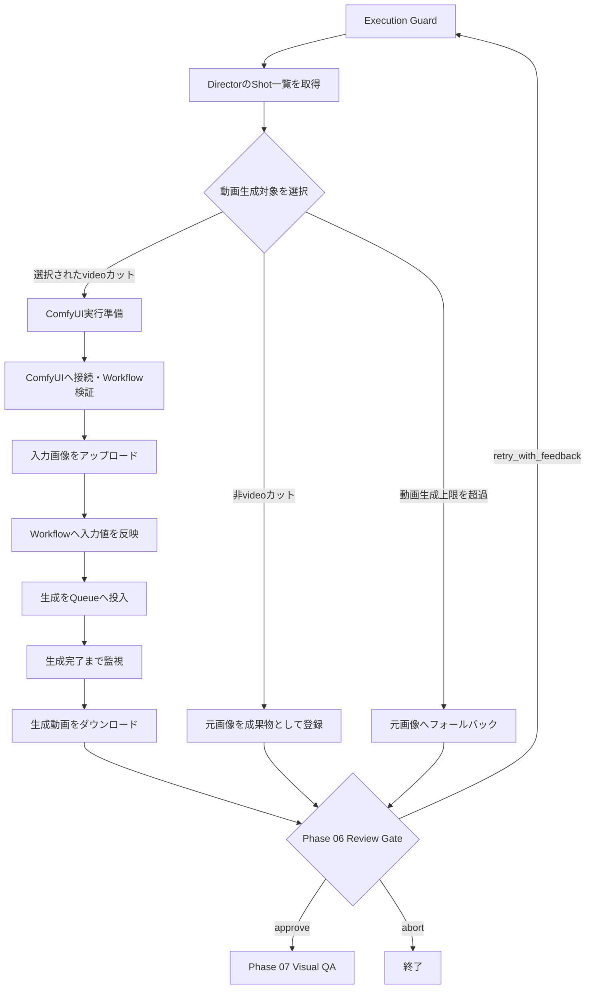
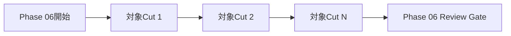

# Phase 06: Image / Video Production

## 目的

承認済みの`DirectionPlan`を使い、画像または動画の実成果物を生成する。

現在の実装では、動画対象カットについてComfyUI DesktopのローカルAPIへ
Image-to-Video生成を依頼する。動画生成対象外のカット、または1回の実行上限を
超えたカットは、元画像を静止画成果物として次へ渡す。

このフェーズは創造的な方針を決める場所ではない。Directorが決定した内容を
外部生成バックエンドで実行し、生成結果と実行記録を保存する実行フェーズ。

## 修正後の確定仕様

状態: `design_confirmed / implementation_pending`

Phase 05とPhase 06の間に、決定論的な`Phase 05.5 Support Video Creator`を置く。
これは新しい演出を考えるエージェントではなく、`DirectionPlan`をComfyUIなどの
生成バックエンドが受け取れる`ProductionRequest`へ変換するアダプターである。



- Support Video Creatorは秒数、プロファイル、モデル制約から`width`、`height`、
  `frames`、`steps`、`fps`、Workflow入力値を作る。
- モデル上限を超えるカットを意味的に自動分割しない。Writer / Storyboardまたは
  Directorへ戻すか、人間が明示した分割規則を使う。
- Phase 06はQueueから1カットだけ取り出して生成し、直後にPhase 07Aへ渡す。
- Stateには`production_queue`、`current_cut_id`、`generated_cut_ids`、
  `approved_cut_ids`、`failed_cut_ids`、`cut_attempts`、`cut_results`を持つ。
- 無限ループを防ぐため、`max_attempts_per_cut`と
  `max_total_production_attempts`を別々に設ける。現行の
  `max_total_phase_executions: 30`だけには依存しない。
- `max_video_cuts_per_run`は現在の安全上限であり、修正後のカット別ループそのものではない。
- `video_required`カットの静止画フォールバックはDraft確認専用とし、最終合格には使わない。
- ローカルComfyUI、研究室GPU、従量課金GPUなどを同じインターフェースで切り替えられるようにする。
- Phase 06単独の一括Review Gateは廃止し、各カットの確認はPhase 07AのReview Policyへ統合する。

## 現在の処理フロー



現在は選択されたすべての生成対象をPhase 06の内部で順番に処理し、
処理全体が終わった後に1回だけReview Gateへ進む。

## 最初に渡す情報

### DirectorのShot

Phase 05から、Storyboard、素材、演出、プロンプト、生成設定を結合した
Shot一覧を受け取る。

```json
{
  "id": 4,
  "name": "光のクライマックス",
  "scene": "皿倉山から見た壮大な北九州の夜景",
  "seconds": 8,
  "media_strategy": "video",
  "asset": {
    "asset_id": "asset-004",
    "local_path": "assets_dl/皿倉山夜景05-scaled.jpg"
  },
  "positive_prompt": "北九州の実在する街並みを維持し、街の光を穏やかに動かす。",
  "negative_prompt": "distorted architecture, flickering, motion smear",
  "camera_motion": "slow stable push-in",
  "generation_profile_name": "draft",
  "generation_profile": {
    "width": 576,
    "height": 384,
    "frames": 49,
    "steps": 20,
    "fps": 24
  }
}
```

`camera_motion`は現在、ComfyUIへ独立したフィールドとして送信しない。
Directorが`positive_prompt`の文章へ反映していることを前提とする。

### Production設定

通常のLLM実行で使用する`config_llm.yaml`は、現在次の設定。

```yaml
production:
  backend: comfy
  max_video_cuts_per_run: 1
  continue_on_cut_error: false
  profile: draft
```

- `backend`: `comfy`の場合は実生成、`mock`の場合はRequest JSONのみ作成
- `max_video_cuts_per_run`: 1回のPhase 06で実生成する動画カット数
- `continue_on_cut_error`: 1カット失敗後も後続カットを処理するか
- `profile`: Directorへ渡す推奨生成プロファイル

### ComfyUI設定

```yaml
comfy:
  base_url: http://127.0.0.1:8188
  workflow_api_json: workflows/ltx_i2v_api.json
  poll_interval_seconds: 2
  timeout_seconds: 1800
```

実生成時はComfyUI Desktopが起動し、ローカルAPIへ接続できる必要がある。

## 現在の処理

1. Execution Guardがフェーズ実行回数、全体実行数、経過時間を確認する
2. Directorの`shots`が存在するか確認する
3. `media_strategy: video`のカットを動画生成候補にする
4. `max_video_cuts_per_run`と任意の`video_cut_ids`から実生成対象を選ぶ
5. 各Shotの`asset.local_path`がローカルに存在するか確認する
6. ComfyUI API形式Workflowを読み込む
7. 必要なノード種類と入力マッピングを検証する
8. 元画像をComfyUIの`/upload/image`へ送信する
9. 次の値をWorkflowへ反映する
   - 入力画像
   - Positive Prompt
   - Negative Prompt
   - Width
   - Height
   - Frames
   - Steps
   - FPS
   - Seed
   - 出力ファイル名
10. `/prompt`へWorkflowを送信する
11. `/history/{prompt_id}`を定期確認して完了を待つ
12. `/view`から生成結果を取得する
13. `work/production/`へ保存する
14. 成果物と生成記録をLangGraphのStateへ保存する
15. Phase 06 Review Gateへ進む

Phase 06自体はLLMを呼び出さない。Directorが作った生成指示を
決定論的にComfyUIへ渡す。

## 動画の長さ

現在の動画長は、Storyboardの`seconds`ではなく
`generation_profile.frames / generation_profile.fps`で決まる。

### Draft

```text
49 frames / 24 fps = 約2.04秒
```

### Final

```text
97 frames / 24 fps = 約4.04秒
```

現在は、たとえばStoryboardが`seconds: 8`でも8秒分の動画へ自動変換しない。
Storyboardの秒数と生成尺を一致させる処理は未実装。

## 現在のカット処理単位

現在はカットごとにLangGraphを停止する構造ではない。



`max_video_cuts_per_run: 1`のため、通常は1カットだけ生成してReview Gateへ
進むように見える。しかし、これはカット単位Reviewを実装しているためではなく、
単に動画生成上限が1件だから。

上限を増やした場合は、対象カットをPhase 06内部で連続生成した後に
Review Gateへ進む。

## 次のステップへ渡す情報

### ComfyUIで生成できた動画

```json
{
  "phase": "image_video_production",
  "cut_id": 4,
  "kind": "video",
  "path": "work/production/result.mp4",
  "backend": "comfy",
  "prompt_id": "ComfyUIの生成ジョブID",
  "elapsed_seconds": 158.2
}
```

実行記録には、使用したWorkflow、入力マッピング、解像度、フレーム数、
steps、fps、seedも保存する。

### 動画生成上限を超えたカット

```json
{
  "phase": "image_video_production",
  "cut_id": 5,
  "kind": "source_image_fallback",
  "path": "assets_dl/source.jpg",
  "backend": "source",
  "generation_deferred": true,
  "reason": "max_video_cuts_per_run"
}
```

### 動画対象外のカット

```json
{
  "phase": "image_video_production",
  "cut_id": 2,
  "kind": "source_image",
  "path": "assets_dl/source.jpg",
  "backend": "source"
}
```

## 現在の自動検証

- DirectorのShot一覧が存在する
- 各Shotにローカル入力画像がある
- ComfyUIへ接続できる
- API形式Workflowを読み込める
- Workflowが要求するノード種類をComfyUIが利用できる
- 必須入力をComfyUIノードへマッピングできる
- ComfyUIが生成結果を返す
- 出力ファイルをダウンロードできる

## 現在の人間確認

`config_llm.yaml`は`autonomy_preset: manual`かつ
`image_video_production: always`のため、Phase 06終了後に必ず停止する。

### 選択できる操作

- `approve`: Phase 07 Visual QAへ進む
- `retry_with_feedback`: Phase 06を再実行する
- `abort`: ワークフローを終了する

### 現在の制限

Phase 06はReview Gateで入力された文章を解釈しない。

```text
解像度を下げて再生成してください
```

と入力しても、現在は解像度やプロンプトを自動変更できない。
同じ生成設定で再実行され、未指定Seedだけが変わる可能性がある。

また、Phase 06のReview GateからDirectorへ直接戻る経路はない。

## エラー時

- 入力画像がない場合は、そのカットをBlocking Issueへ追加する
- ComfyUI接続、Workflow検証、生成、ダウンロードの例外を記録する
- `continue_on_cut_error: false`の場合は最初の生成エラーで後続生成を止める
- Blocking Issueがある場合、Phase 06の結果は`error`になる
- `manual`では、エラー結果もReview Gateで人間へ提示する

## 現在の注意点

- Storyboardの秒数をフレーム数へ変換していない
- 実動画生成は通常1回につき最大1カット
- カットごとの生成直後Reviewはない
- フィードバック内容に応じた設定変更や差し戻し先判定はない
- Directorへの単一カット差し戻しはない
- 生成済みカットを固定して失敗カットだけ再生成するState管理がない
- `generated_image`向け画像生成は未実装
- 生成動画の内容をPhase 06では評価しない
- ローカル、大学GPU、クラウドの実行先切り替え抽象化は未実装

これらは[Phase 06 Revision Backlog](REVISION_BACKLOG_PHASE_06.md)に
修正案として記録する。
