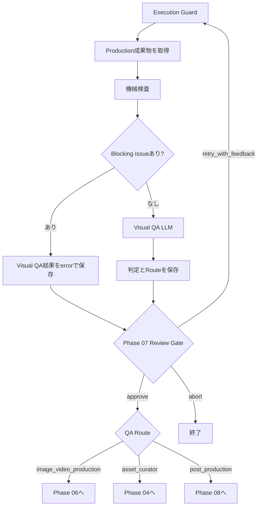

# Phase 07: Visual QA

## 目的

Phase 06 Image / Video Productionが作成した成果物を検査し、
次へ進めるか、生成または素材選定へ差し戻すかを判断する。

現在は、成果物ファイルの存在確認とゼロバイト検査を行った後、
LLMがStoryboard、Direction Plan、生成記録などのメタデータを評価する。

現在のVisual QAは、実際の動画フレームを見て品質判定する処理ではない。
映像内容の本格的な評価は未実装。

## 修正後の確定仕様

状態: `design_confirmed / implementation_pending`

Visual QAを`Phase 07A Cut QA`と`Phase 07B Sequence Readiness QA`へ分割する。

### Phase 07A: Cut QA

- Phase 06が1カット生成するたびに実行する。
- `ffprobe`でファイル、コーデック、解像度、fps、実尺、破損を検査する。
- 代表フレームまたは短いサンプルをVLMへ渡し、元画像保持、ちらつき、歪み、
  プロンプト適合、カメラ移動を評価する。
- 問題の種類に応じて差し戻し先を変える。

```text
runtime / file error       -> Phase 06
model parameter problem    -> Phase 05.5 Support Video Creator
prompt / camera problem    -> Phase 05 Director（対象カットのみ）
source image problem       -> Phase 04 Asset Curator（対象カットのみ）
pass                       -> 次のカット
```

- Review Policyはカット単位で`always / on_exception / never`を適用する。
- 合格済みカットをロックし、修正対象以外を再生成しない。

### Phase 07B: Sequence Readiness QA

- 全カットがPhase 07Aを通過した後に1回実行する。
- 順序、指定尺、色調、動き、音声素材、欠落カットなど、編集へ進める準備を確認する。
- ここではまだ一本化した完成動画がないため、最終的なテンポやつなぎの品質を断定しない。
- 実際の完成動画のペース、字幕、音、カット接続はPhase 08後の確認とH3、
  必要に応じてPhase 09で評価する。

## 現在の処理フロー



## 最初に渡す情報

### Production成果物

Phase 06から、生成動画または静止画成果物を受け取る。

動画成果物の例:

```json
{
  "phase": "image_video_production",
  "cut_id": 4,
  "kind": "video",
  "path": "work/production/result.mp4",
  "backend": "comfy",
  "prompt_id": "ComfyUIの生成ジョブID",
  "elapsed_seconds": 158.2
}
```

静止画フォールバックの例:

```json
{
  "phase": "image_video_production",
  "cut_id": 5,
  "kind": "source_image_fallback",
  "path": "assets_dl/source.jpg",
  "generation_deferred": true
}
```

### LLM評価へ渡す情報

機械検査を通過した場合は、次をVisual QA LLMへ渡す。

- Project設定
- Storyboard
- DirectorのDirection Plan
- Phase 06のProduction結果
- 成果物一覧
- 機械検査結果
- 人間が前回入力したReview Feedback

同時に、現在の評価では動画フレームを渡していないことを明示する。

```text
No decoded video frames are supplied in this text-only pass.
```

そのため、LLMには実際に映像を見たかのような判断をしないよう指示している。

## 現在の処理

1. Execution Guardが実行回数、全体実行数、経過時間を確認する
2. Phase 06の成果物一覧を取得する
3. 各成果物に`path`があるか確認する
4. 指定されたファイルが存在するか確認する
5. ファイルサイズが0バイトではないか確認する
6. 技術的Blocking Issueがある場合はLLM評価を行わない
7. Blocking Issueがない場合はVisual QA LLMを実行する
8. Storyboard、Direction Plan、生成メタデータの整合性を評価する
9. 全体判定、カット別判定、差し戻し先、信頼度を保存する
10. Phase 07 Review Gateへ進む
11. 人間が承認した場合、QAのRouteに従って次のフェーズへ移動する

## 現在の機械検査

現在実装されている検査:

- ファイルパスが存在する
- ファイルが実際に存在する
- ファイルサイズが0バイトではない

現在未実装の検査:

- ffprobeによるduration
- FPS
- 解像度
- コーデック
- 動画を最後までデコードできるか
- 黒画面
- 静止・フリーズ
- フリッカー
- 音声ストリーム

## 現在のLLM評価

Visual QA LLMの役割は次のとおり。

- Storyboardの意図と生成記録を比較する
- Directorの指示とProduction結果のメタデータを比較する
- 問題をカット単位で整理する
- `pass / revise / replace_asset`を判定する
- 次に進むフェーズを選ぶ
- 視覚証拠がないことを信頼度へ反映する

現在のLLMは動画の画素や動きを確認していないため、次を本当に評価できない。

- 建築物や地形が変形していないか
- フリッカーやモーションスメアがあるか
- カメラワークが指示どおりか
- 元画像の構図や色彩を維持しているか
- 不自然な人物や車両の動きがないか
- 動画の開始・終了フレームが自然か

## 現在の出力形式

```json
{
  "verdict": "pass",
  "route": "post_production",
  "issues": [],
  "cut_results": [
    {
      "cut_id": 4,
      "verdict": "pass",
      "issues": []
    }
  ],
  "confidence": 0.8,
  "checked_artifacts": 1,
  "checks": [
    "ファイル存在",
    "ゼロバイトでないこと",
    "LLM metadata review"
  ]
}
```

### Verdict

- `pass`: QAを通過
- `revise`: 再生成が必要
- `replace_asset`: 元素材の交換が必要

### Route

現在選択できるRoute:

- `image_video_production`: Phase 06へ戻る
- `asset_curator`: Phase 04へ戻る
- `post_production`: Phase 08へ進む

現在はDirectorおよびSupport Video Creatorへ直接戻るRouteがない。

## 現在の人間確認

`config_llm.yaml`は`autonomy_preset: manual`かつ
`visual_qa: always`のため、Visual QA実行後に必ず人間確認で停止する。

### 選択できる操作

- `approve`: QAが決定したRouteを採用する
- `retry_with_feedback`: フィードバック付きでVisual QA自体を再実行する
- `abort`: ワークフローを終了する

`retry_with_feedback`は動画を再生成する操作ではない。
Visual QAへ追加情報を与えて、判定をやり直す操作。

生成結果を修正する場合は、QA結果を承認して
`image_video_production`または`asset_curator`へ進ませる必要がある。

## 現在の差し戻し動作

### Phase 06へ戻る場合

Phase 06全体を再実行する。現在は問題のあるカットだけを指定して
Directorのプロンプトを修正する処理はない。

### Phase 04へ戻る場合

Asset Curator以降のDirector、Production、Visual QAを再実行する。
現在は対象カットだけを差し替える部分更新ではない。

### Phase 08へ進む場合

Production成果物をPost Productionへ渡す。

## エラー時

- 成果物にパスがない場合はBlocking Issueにする
- ファイルが存在しない場合はBlocking Issueにする
- ファイルが空の場合はBlocking Issueにする
- Blocking Issueがある場合は`route: image_video_production`にする
- LLMへ渡す前の技術検査で失敗した場合はLLM評価を省略する
- Review Gateで人間へエラー内容を提示する

## 現在の注意点

- 全成果物をまとめて評価し、カット単位の生成ループになっていない
- 実動画フレームをLLMまたはVLMへ渡していない
- ファイルの存在だけで内容品質を判断している
- ffprobeによる技術検査がない
- 問題原因の詳細分類がない
- Directorへ単一カットだけ差し戻せない
- Support Video Creatorへ生成設定だけ差し戻せない
- 合格済みカットを固定できない
- カット間の連続性を独立して評価していない

修正後は、Phase 07Aのカット単位QAとPhase 07Bの全体QAへ分割する。
詳細は[Phase 07 Revision Backlog](REVISION_BACKLOG_PHASE_07.md)に記録する。
