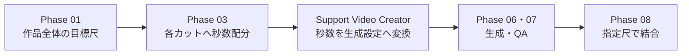
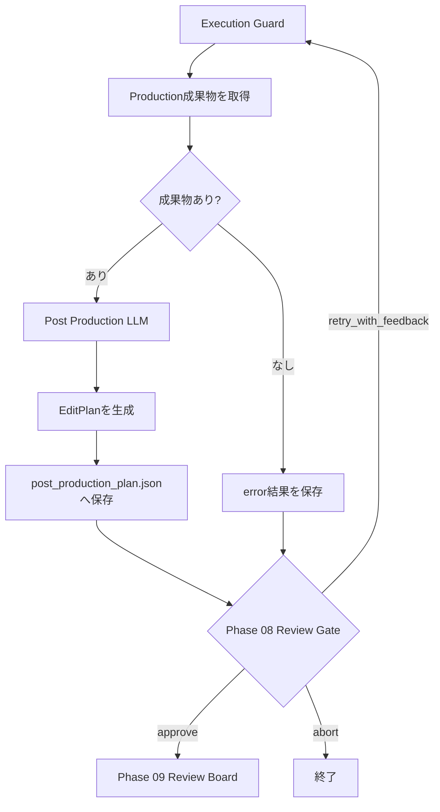

# Phase 08: Post Production

## 目的

Phase 07を通過した画像・動画成果物をStoryboard順に並べ、
字幕、ナレーション、BGMなどの編集方針を含む最終動画の編集計画を作る。

現在実装されているのは`EditPlan`とタイムラインJSONの生成まで。
FFmpegによる素材の正規化、結合、字幕・音声追加、最終MP4出力は未実装。

## 修正後の確定仕様

状態: `design_confirmed / implementation_pending`

- 入力はPhase 07で承認済みになった成果物だけを収めた`ApprovedCutManifest`とする。
- `8A Edit Planning`、`8B FFmpeg Assembly`、`8C Technical QA`の3段階に分ける。
- Phase 03で確定したカット順と秒数、Phase 01の総尺を制約として扱う。
- `video_required`は動画クリップ必須とし、静止画は`still_allowed`、
  `still_preferred`またはDraft専用フォールバックの場合だけ使用する。
- 素材が長い場合は許容範囲内でトリムできるが、短い場合や欠落時は上流へ戻し、
  無断で最終尺を短縮しない。
- 解像度、fps、コーデック、色空間、音声形式を正規化した後、結合、字幕、
  ナレーション、BGM、音量調整を行う。
- 出力は少なくとも最終MP4、タイムライン、編集ログ、技術検査結果を含む。
- `8C Technical QA`で総尺、再生可能性、映像・音声ストリーム、黒フレーム、
  音割れなどを検査し、不合格なら8Aまたは8Bへ戻す。

## 尺を決める責務

Phase 08は作品の尺やカット秒数を新しく決めない。



- Phase 01: `target_duration_seconds`を決定する
- Phase 03: 各カットの`seconds`を決定し、合計を目標尺へ合わせる
- Support Video Creator: 秒数をframes / fpsへ変換する
- Phase 06・07: カットを生成・検査し、使用可能な成果物を確定する
- Phase 08: 承認済み成果物を決められた順序と秒数で結合する

Phase 08は、上流で承認された尺と実成果物の尺が一致するかを検証する。
不一致を発見しても、編集都合で新しい尺を勝手に決定しない。

## 現在の処理フロー



## 最初に渡す情報

現在、Post Production LLMへ次を渡す。

- Project設定
- Storyboard
- Phase 07 Visual QA結果
- Phase 06の画像・動画成果物
- 人間が前回入力したReview Feedback

成果物例:

```json
{
  "phase": "image_video_production",
  "cut_id": 4,
  "kind": "video",
  "path": "work/production/cut_04.mp4",
  "backend": "comfy"
}
```

現在はCreative Concept、DirectorのDirection Plan、カット単位QA Evidenceを
Post Production LLMへ直接渡していない。

## 現在の処理

1. Execution Guardが実行回数、全体実行数、経過時間を確認する
2. Phase 06のProduction成果物が存在するか確認する
3. Project、Storyboard、Visual QA、成果物一覧をLLMへ渡す
4. Post Production用の役割プロンプトを適用する
5. LLMが順序付き編集操作を生成する
6. ナレーション、BGM、字幕の方針を生成する
7. 最終尺を含む`EditPlan`を生成する
8. `work/post/post_production_plan.json`へ保存する
9. Phase 08 Review Gateへ進む

LLMには、FFmpegを実行したと主張せず、別のツールが実行できる計画だけを
返すよう指示している。

## 現在の出力形式

```json
{
  "operations": [
    {
      "order": 1,
      "operation": "normalize_media",
      "cut_id": 1,
      "parameters": {
        "width": 1920,
        "height": 1080,
        "fps": 24
      }
    },
    {
      "order": 2,
      "operation": "concatenate",
      "cut_id": null,
      "parameters": {
        "transition": "hard_cut"
      }
    }
  ],
  "narration_direction": "昼から夜へ徐々に高揚させる",
  "bgm_direction": "静かな導入から壮大なクライマックスへ",
  "subtitle_direction": "白文字を画面下部へ表示する",
  "final_duration_seconds": 30,
  "implementation": "ffmpeg_pending",
  "source_artifacts": [],
  "plan_path": "work/post/post_production_plan.json"
}
```

## 現在作成している成果物

```text
workflow_v2/work/post/post_production_plan.json
```

このJSONは編集指示であり、完成動画ではない。

## 現在実行していない処理

- 画像・動画の解像度統一
- FPS統一
- カットのトリミング
- 静止画の動画化
- カット結合
- トランジション
- 字幕生成・焼き込み
- ナレーション生成
- ACE-StepによるBGM生成
- 音声ミックス
- 音量正規化
- 最終MP4エンコード
- ffprobeによる完成動画検査

## 「静止画」の意味

Phase 08では、次の3種類を区別する。

### ComfyUIへの入力画像

北九州の写真など、Image-to-Video生成の元になる画像。
最終成果物で静止画として使うことを意味しない。

### 意図的な静止画カット

Storyboardと人間が、最終動画でも写真として見せることを承認したカット。
必要であればPhase 08で緩やかなパン・ズームを付ける。

### Draft用フォールバック

動画生成が未完了または失敗した場合に、全体構成を仮確認するための代替画像。
本番で`video_required`のカットを合格扱いにするものではない。

修正後の通常方針では、`video_required`のカットはPhase 06・07で
合格動画が得られるまで修正し、Phase 08へ渡す。

## 現在の人間確認

`config_llm.yaml`は`autonomy_preset: manual`かつ
`post_production: always`のため、EditPlan作成後に必ず停止する。

### 選択できる操作

- `approve`: EditPlanを承認してPhase 09へ進む
- `retry_with_feedback`: Post Production LLMへ修正指示を渡して再実行する
- `abort`: ワークフローを終了する

修正指示例:

```text
Storyboardで決めたカット順と秒数を変更しないでください。
Cut 6からCut 7だけ短いクロスフェードにしてください。
字幕は画面下部に1行で表示してください。
```

現在はEditPlanのJSONだけが修正され、実動画には反映されない。

## 次のステップへ渡す情報

現在は、EditPlanと`post_production_plan.json`のパスをPhase 09へ渡す。

Phase 09は現在、実際の最終MP4ではなく、この編集計画を評価する。

## エラー時

- Production結果がない場合はPost Productionを実行しない
- Blocking Issueとして`Image/Video Production成果物が必要`を保存する
- LLM出力がEditPlan Schemaに一致しない場合は再試行する
- 実行上限に達した場合は人間確認または安全停止へ進む

## 現在の注意点

- 最終MP4を生成していない
- LLMがStoryboardの秒数を変更しないことをコードで保証していない
- Production成果物がPhase 07で本当に承認済みか厳密に検証していない
- `video_required`と静止画許可の区別がない
- 実測尺とStoryboard秒数を比較していない
- 出力解像度、FPS、コーデックを設定として固定していない
- 音声、字幕、BGMの実ファイルがない
- Review Boardが完成動画ではなく編集計画を評価している

修正案は[Phase 08 Revision Backlog](REVISION_BACKLOG_PHASE_08.md)へ記録する。
