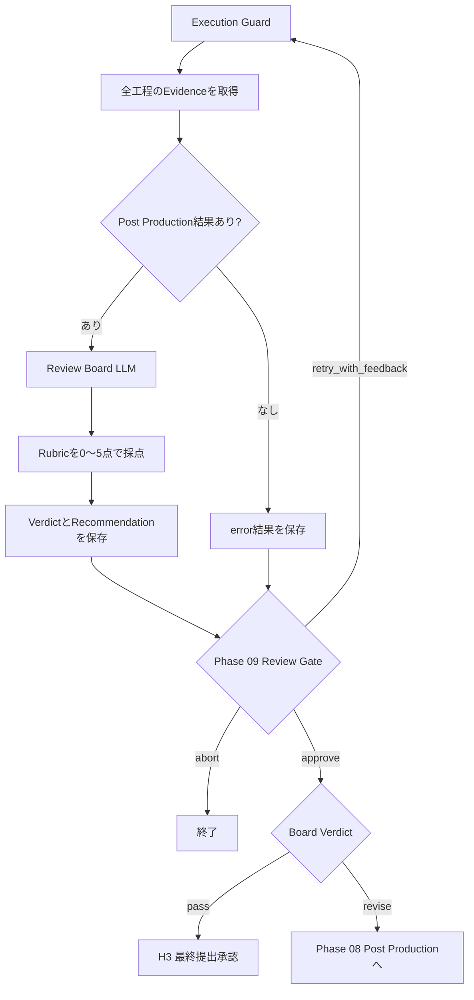
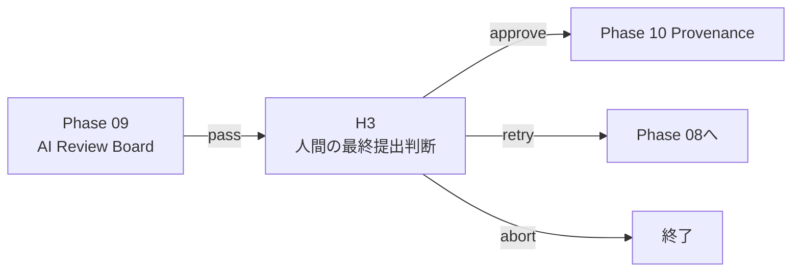

# Phase 09: Review Board

## 目的

完成したプロジェクトが、Phase 01で定義した目的、制約、成功基準と、
応募対象の評価観点を満たしているかを総合的に審査する。

Phase 07は個別カットとカット間の品質を検査し、Phase 08は最終動画を編集する。
Phase 09は、それらを作品全体・提出物全体として評価する最終AI審査。

現在は最終MP4が未実装のため、完成動画ではなく企画、Storyboard、
Visual QA結果、編集計画などのテキストEvidenceを評価している。

## 修正後の確定仕様

状態: `design_confirmed / implementation_pending`

締切優先の初期版では、Review Boardを任意にスキップできる。

```yaml
review_board:
  mode: ai          # AIが完成作品を審査
  # mode: human_only  # AI審査をスキップし、H3へ直接進む
```

- `human_only`はPhase 09のAI審査だけを省略し、H3の人間による最終提出承認は必須にする。
- `review_policies.review_board: never`は「Phase 09後のReview Gateを自動通過する」
  という意味であり、AI審査そのものをスキップする設定ではない。
- `require_human`なH3は`--auto`より優先し、完全自動実行でも勝手に提出承認しない。
- フェーズ別`review_policies`は`custom`プリセットだけでなく、明示的な個別指定が
  常にプリセットを上書きできるよう設定解決規則を統一する。
- スキップした場合も、理由、操作者、時刻、使用モードを証跡へ記録する。
- AI審査を使う場合は固定Rubricで採点し、将来は完成動画の代表フレーム、
  音声、字幕、技術検査結果をEvidenceとして使う。
- `revise`はPhase 08へ戻す。素材・演出に原因がある場合は、修正分類を付けて
  適切な上流工程へ送る。

## Phase 07・08との違い

```text
Phase 07A: 個別カットが使用可能か
Phase 07B: カット間の流れが成立しているか
Phase 08: 承認済みカットを一本の動画へ編集する
Phase 09: 完成作品が提出水準に達しているか
H3: 人間が実際に提出してよいか最終判断する
```

## 現在の処理フロー



## 最初に渡す情報

現在、Review Board LLMへ次を渡す。

- Project設定
- Phase 01 Project Brief
- Phase 02 Creative Concept
- Phase 03 Storyboard
- Phase 04 Asset Manifest
- Phase 07 Visual QA結果
- Phase 08 Post Production結果
- 人間が前回入力したReview Feedback

同時に、現在は完成MP4を実際に検査できないことを明示する。

```text
Rendered final MP4 inspection is not yet available.
```

LLMには、完成動画Evidenceがない場合は信頼度を低くし、
Evidenceがない内容を見たかのように主張しないよう指示している。

## 現在の処理

1. Execution Guardが実行回数、全体実行数、経過時間を確認する
2. Phase 08のPost Production結果が存在するか確認する
3. 全上流工程のテキストEvidenceを取得する
4. Review Boardの役割プロンプトとEvidenceをLLMへ渡す
5. LLMが任意のRubric項目を0〜5点で採点する
6. 算術平均を計算して`average`として返す
7. `pass / revise`を判定する
8. 修正推奨を作成する
9. Schemaと平均値を検証する
10. Phase 09 Review Gateへ進む
11. 人間がBoard判定を承認した場合、Verdictに従ってRouteを選ぶ

## 現在の出力形式

```json
{
  "rubric_scores": {
    "concept_consistency": 4.0,
    "story_structure": 4.0,
    "asset_traceability": 4.0,
    "technical_completion": 2.0
  },
  "average": 3.5,
  "verdict": "revise",
  "recommendations": [
    "最終MP4を生成してください",
    "完成動画の技術検査後に再評価してください"
  ],
  "confidence": 0.6
}
```

### 検証

- 各Rubric点は0〜5
- `rubric_scores`は1項目以上
- `average`は0〜5
- `average`と実際の算術平均の差は0.15以内
- `verdict`は`pass / revise`
- `confidence`は0〜1

現在は合格点や必須Blocking Issueをコードで固定していない。
LLM自身が`pass / revise`を判断する。

## 現在の決定論的フォールバック

LLMを使用できない場合のフォールバックは、次を採点する。

- コンセプト一貫性
- ストーリー構成
- 素材追跡可能性
- 技術的完成度

ただし現在のフォールバックは、FFmpeg未実装で技術完成度が低くても
`verdict: pass`を返す。この挙動は提出判定として安全ではなく、修正が必要。

## 現在の人間確認

`config_llm.yaml`は`autonomy_preset: manual`かつ
`review_board: always`のため、Board評価後に必ず停止する。

### 選択できる操作

- `approve`: Boardの判定とRouteを採用する
- `retry_with_feedback`: Boardへ追加情報を渡して再採点する
- `abort`: ワークフローを終了する

`approve`は作品を必ず合格にする操作ではない。
Boardが`revise`の場合は、承認後にPhase 08へ戻る。

Boardが`pass`の場合は、H3の人間による最終提出承認へ進む。

## H3との違い

Phase 09はAIまたは規則による審査。
H3は人間が実際の提出可否を判断する最終ゲート。



## `review_policies.review_board: never`の意味

現在の`never`はReview Board LLMそのものをスキップしない。

```yaml
review_policies:
  review_board: never
```

これは「Review Board実行後の人間確認を省略する」という意味。
Phase 09のAI審査を実行せずH3へ直接進む機能は、現在未実装。

## 現在の差し戻し

- Boardが`pass`: H3へ
- Boardが`revise`: Phase 08へ
- H3で`retry`: Phase 08へ

現在は、問題原因に応じてDirector、Production、Asset Curatorへ
直接戻すRouteはない。

## 現在の注意点

- 完成MP4を入力として受け取っていない
- 動画、代表フレーム、音声をAIへ渡していない
- 編集計画を完成作品の代わりに評価している
- 評価Rubricが固定されていない
- Rubricごとの根拠Evidenceを必須にしていない
- 合格閾値とBlocking Issueをコードで固定していない
- 決定論的フォールバックが未完成でも`pass`を返す
- `revise`の差し戻し先がPhase 08に固定されている
- AI Review Boardを安全にスキップする`human_only`モードがない
- `--auto`では通常の人間Review Gateが自動承認される

修正案は[Phase 09 Revision Backlog](REVISION_BACKLOG_PHASE_09.md)へ記録する。
