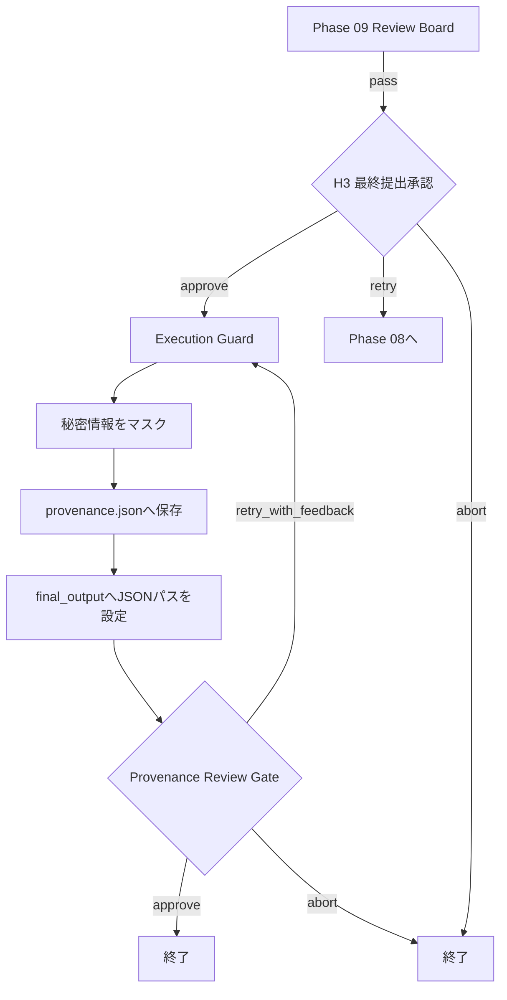

# Phase 10: Provenance & Submission Package

## 目的

H3で人間が最終提出を承認した後、完成動画と制作過程の証跡を保存する。

現在はLangGraph Stateの主要情報を`provenance.json`へ書き出す処理を行う。
完成動画、提出用Manifest、技術レポート、制作過程を可視化したHTMLなどを
まとめた提出パッケージは未実装。

## 修正後の確定仕様

状態: `design_confirmed / implementation_pending`

Phase 10は単一JSONの保存ではなく、実行ごとの提出パッケージを生成する。

```text
submissions/<run_id>/
├── final_video.mp4
├── submission_manifest.json
├── provenance.json
├── process_report.html
├── process_report.md
├── decision_log.json
├── technical_report.json
└── artifacts/
```

- `final_output`は`provenance.json`ではなく提出用動画を指す。
- 各工程の入力、構造化出力、承認、修正指示、差し戻し、モデル、生成設定、
  所要時間、コスト、成果物ハッシュを追跡する。
- `process_report`では、どのAgentが何を提案し、人間またはAIが何を判断し、
  どの修正が採用されたかを時系列で可視化する。
- 保存する根拠は要約された判断理由とEvidenceであり、モデル内部の
  Chain-of-Thoughtは保存・公開しない。
- 公開用の提出資料と、APIキーやローカルパスを除いた内部監査用証跡を分ける。
- 同じ`run_id`の成果物を一つのディレクトリへ集約し、Manifestとハッシュで対応を保証する。
- H3承認後のPhase 10は原則自動実行し、独立した常時Review Gateは置かない。
  パッケージ生成エラーなどの例外時だけ確認する。

## 現在の処理フロー



`human_only`でPhase 09をスキップする改修後も、H3で人間が承認した後に
Phase 10へ進む。

## 現在保存している情報

```json
{
  "run_id": "run-xxxx",
  "project": {},
  "config": {},
  "phase_results": {},
  "reviews": [],
  "events": [],
  "artifacts": []
}
```

### `run_id`

ワークフロー実行を識別するID。

### `project`

- 応募対象
- テーマ
- 目標尺

### `config`

- Autonomy Preset
- Review Policy
- 実行上限
- LLM設定
- Production設定
- ComfyUI設定

### `phase_results`

各フェーズの次の情報。

- Status
- Summary
- Data
- Artifacts
- Confidence
- Blocking Issues
- Warnings
- Attempt
- 適用されたFeedback

### `reviews`

- Review対象フェーズ
- Policy
- 人間またはPolicyによる判断
- `approve / retry_with_feedback / abort`
- Feedback
- 判断時刻

### `events`

ワークフロー内で発生したフェーズ実行、Review、Routeなどのイベント。

### `artifacts`

画像、動画、編集計画、QA Evidenceなど、各工程が登録した成果物。

## 現在の秘密情報除去

ConfigやStateを保存する前に、キー名へ次が含まれる値を`***`へ置換する。

- `api_key`
- `token`
- `secret`

```json
{
  "api_key": "***"
}
```

現在はキー名に基づく簡易マスクであり、文字列内部へ埋め込まれた秘密情報や
URLパラメータなどの高度な検出は行わない。

## 現在の出力

```text
workflow_v2/work/provenance.json
```

保存後、Stateの`final_output`へこのJSONのパスを設定する。

```json
{
  "final_output": "workflow_v2/work/provenance.json"
}
```

本来の`final_output`は完成動画を指すべきであり、証跡パスとは分離が必要。

## 現在の人間確認

Provenance保存後にもReview Gateがある。

- `approve`: ワークフロー終了
- `retry_with_feedback`: Provenanceを再保存
- `abort`: 終了

H3で最終提出承認済みのため、正常な保存後に人間をもう一度停止させる必要性は
低い。現在のProvenance処理はFeedbackを解釈しないため、
`retry_with_feedback`しても基本的に同じ内容を再保存する。

また、最初にJSONを保存した時点では、その後に行われるProvenance Reviewの
判断はまだ`provenance.json`内へ含まれない。

## 現在できていること

- 実行ごとのProjectとConfigを取得する
- 各フェーズの結果をまとめる
- Review履歴を保存する
- Event履歴を保存する
- Artifact一覧を保存する
- 基本的な秘密情報をマスクする
- JSONとして機械可読な証跡を作る

## 現在できていないこと

- 完成動画を提出フォルダへまとめる
- `final_output`と証跡パスを分離する
- Run IDごとに別フォルダへ保存する
- 過去Runの上書きを防止する
- ファイルのSHA-256を計算する
- 提出用Manifestを作る
- Technical QAレポートを同梱する
- Storyboardや生成プロンプトを個別ファイルへ出力する
- 人間が読める制作レポートを作る
- インタラクティブな工程タイムラインを作る
- 修正前後の差分を可視化する
- H3判断とPhase 09スキップ理由を専用項目としてまとめる

修正案は
[Phase 10 Revision Backlog](REVISION_BACKLOG_PHASE_10.md)へ記録する。
