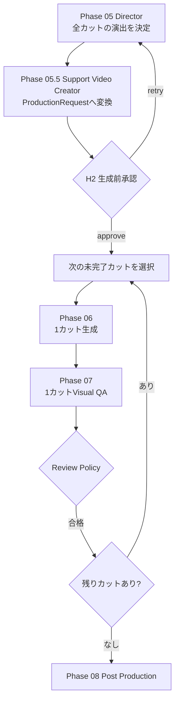
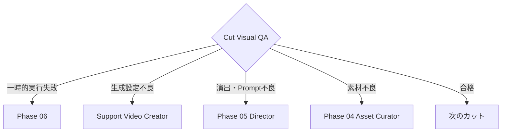

# Phase 06 Revision Backlog

Phase 05 DirectorからPhase 07 Visual QAまでを、生成基盤に依存しない設計と
カット単位の安全な生成・修正ループへ変更する。

## 目標構成

状態: `pending`



## Phase 05.5: Support Video Creator

状態: `pending`

Directorの直後に、生成基盤向けRequestを作る決定論的な変換ノードを追加する。

これは新しいクリエイティブ担当LLMではない。Directorの意味的な指示を
ComfyUIで安全に実行可能なパラメータへ変換・検証するAdapter。

### 責務

- DirectorのShotを生成基盤非依存の`ProductionSpec`として受け取る
- `seconds`と`fps`から必要フレーム数を計算する
- LTXが処理できるフレーム数へ安全に丸める
- draft / final設定を適用する
- width、height、frames、steps、fps、seedを決定する
- 入力画像の存在と形式を検証する
- Positive Promptへカメラワークが反映されているか確認する
- ComfyUI Workflowの入力へマッピングする
- カットごとの推定生成時間または負荷区分を付ける
- 実行前に全RequestをH2へ提示する

### 目標出力

```json
{
  "cut_id": 4,
  "backend": "comfy",
  "workflow": "workflows/ltx_i2v_api.json",
  "model_profile": "ltx_2b_draft",
  "image_path": "assets_dl/皿倉山夜景05-scaled.jpg",
  "positive_prompt": "北九州の街並みを維持しながら...",
  "negative_prompt": "distorted architecture, flickering",
  "width": 576,
  "height": 384,
  "frames": 97,
  "steps": 20,
  "fps": 24,
  "seed": 12345,
  "requested_seconds": 4,
  "actual_seconds": 4.0417,
  "estimated_cost_class": "medium"
}
```

### フレーム数の変換

単純な初期値:

```text
raw_frames = round(seconds * fps)
```

LTXが要求するフレーム数規則がある場合は、対応可能な最も近い値へ丸め、
`requested_seconds`と`actual_seconds`の両方を保存する。

### H2の変更

現在のH2はDirector結果を確認する。修正後はDirector結果に加え、
Support Video Creatorが作った最終的な生成設定も同時に確認する。

人間が高コストな生成開始前に確認できる情報:

- カット内容と秒数
- 使用画像
- Positive / Negative Prompt
- カメラワーク
- width / height
- frames / fps / 実際の生成秒数
- steps
- 使用Workflowとモデルプロファイル
- 推定負荷

## カット単位生成キュー

状態: `pending`

Phase 06を、全カットを1回のノード内で処理する方式から、
1回のLangGraph反復で1カットだけ生成する方式へ変更する。

### 追加するState

```json
{
  "production_queue": [1, 2, 3, 4],
  "current_cut_id": 1,
  "generated_cut_ids": [],
  "approved_cut_ids": [],
  "failed_cut_ids": [],
  "cut_attempts": {
    "1": 1
  },
  "cut_results": {}
}
```

### 目的

- 失敗したカットだけを再生成する
- 生成済み・承認済みカットを保護する
- カットごとの進捗をUIへ表示する
- 各カットの生成時間を記録する
- 全カットを作り直す無駄を避ける
- 実行中断後に未完了カットから再開できるようにする

## カット単位Visual QA

状態: `pending`

各カットの生成直後にPhase 07 Visual QAを実行する。

最初はファイル検証、メタデータ検証、代表フレーム抽出を行う。
将来はVLMへ代表フレームまたは短い動画を渡し、次を評価する。

- 元画像との一貫性
- 建築、地形、人物の破綻
- フリッカー、モーションスメア
- 指定したカメラワークとの一致
- Directorの演出意図との一致
- カットの開始・終了フレームの品質

## 問題種別による差し戻し

状態: `pending`

すべての失敗をPhase 06へ戻さず、問題種別ごとに修正先を変える。

| QA分類 | 戻り先 | 動作 |
|---|---|---|
| `runtime_transient` | Phase 06 | 同じRequestを再実行 |
| `generation_parameters` | Support Video Creator | frames、steps、解像度などを再計算 |
| `prompt_or_motion` | Phase 05 Director | 対象カットだけ演出を修正 |
| `source_asset` | Phase 04 Asset Curator | 対象カットの素材を再選定 |
| `pass` | 次のカット | 承認済みとして固定 |

目標ルーティング:



## Review Policy

状態: `pending`

カット単位Reviewにも既存の3方針を適用する。

- `always`: 各カットを人間が確認する
- `on_exception`: QA不合格、低信頼度、異常時だけ人間が確認する
- `never`: AI判定だけで次へ進む

初期検証時は`always`、ワークフロー安定後は`on_exception`を推奨する。

設定案:

```yaml
production_review:
  granularity: per_cut
  policy: always
```

`autonomy_preset`との整合を取り、最終的には既存のReview Gate設定から
解決できるようにする。

## Phase 05の単一カット修正

状態: `pending`

Visual QAからDirectorへ戻る場合、DirectionPlan全体を再生成しない。
問題があるカットだけを修正し、合格済みカットを固定する。

### Directorへ渡す修正入力

```json
{
  "revision_scope": "single_cut",
  "target_cut_id": 4,
  "feedback": "カメラの前進が強く、建物が変形して見える",
  "current_direction_plan": {},
  "current_cut_result": {},
  "qa_findings": {},
  "locked_cut_ids": [1, 2, 3]
}
```

### Directorの修正出力

```json
{
  "revision_scope": "single_cut",
  "target_cut_id": 4,
  "revised_shot": {
    "cut_id": 4,
    "asset_id": "asset-004",
    "positive_prompt": "建物を固定し、光と雲だけを穏やかに動かす...",
    "negative_prompt": "distorted architecture, excessive camera motion",
    "camera_motion": "locked camera with subtle environmental motion",
    "generation_profile": "draft"
  },
  "revision_reason": "建物の変形を避けながら夜景の生命感を残すため"
}
```

### マージ規則

- `target_cut_id`のShotだけを置換する
- `locked_cut_ids`のShotは変更を禁止する
- Directorが対象外カットを返した場合は検証エラーにする
- 修正前後の差分をProvenanceへ保存する
- 対象カットのProductionRequestだけを無効化して再構築する
- 対象カットの生成物とQA結果だけを再生成対象にする
- 合格済みの他カットは再利用する

### 大幅な方針変更

単一カット修正で解決できない場合だけ、次の範囲へ段階的に拡大する。

1. `single_cut`: 対象カットのみ
2. `cut_range`: 関連する連続カット
3. `full_direction`: DirectionPlan全体
4. `creative_concept`: Creative Directorへ戻る

人間またはQA Routerが修正範囲を明示する。

## 実行上限

状態: `pending`

既存のフェーズ単位上限に加え、カット単位の生成上限を追加する。

```yaml
execution_limits:
  max_generation_attempts_per_cut: 2
  max_director_revisions_per_cut: 2
  max_asset_reselections_per_cut: 1
```

上限到達時は無限ループせず、人間確認へ切り替える。

## バックエンド抽象化

状態: `pending`

`ProductionRequest`をComfyUI固有形式から分離し、Adapterで実行先へ変換する。

将来の候補:

- ComfyUI Desktop
- 大学GPU上のComfyUI
- RunPodなどの従量課金GPU
- その他の動画生成API

DirectorとStoryboardは実行先を意識しない。

## 実装順序

1. `ProductionRequest` Schemaを追加
2. Support Video Creatorの決定論的変換処理を追加
3. Director → Support Video Creator → H2へGraphを変更
4. カット単位Queue Stateを追加
5. Phase 06を1カット実行へ変更
6. Phase 07をカット単位判定へ変更
7. QA分類と差し戻しRouterを追加
8. Directorの`single_cut`修正モードを追加
9. 合格済みカットのLockと部分的な無効化を追加
10. Review Policyと実行上限をカット単位へ対応
11. UIに進捗、生成物、差分、判断理由を表示

## 完了条件

- H2で実際にComfyUIへ送る全パラメータを確認できる
- 1回のProduction処理が1カットだけを生成する
- 生成直後に対象カットだけをQAできる
- 合格済みカットを再生成しない
- 問題種別に応じて正しい工程へ戻せる
- Directorが指定された1カットだけを修正できる
- 単一カット修正時に他カットが変化しない
- 修正回数上限で安全停止できる
- ローカル以外の実行先へAdapter差し替えで対応できる
