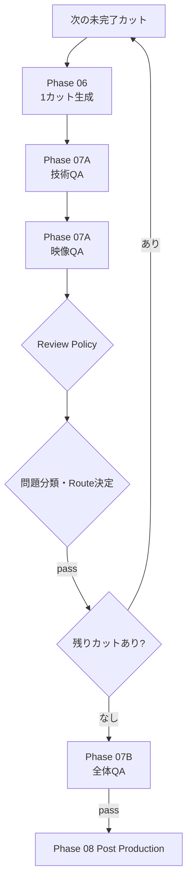

# Phase 07 Revision Backlog

現在の全成果物一括・メタデータ中心のVisual QAを、
「カット生成直後のQA」と「全カット完成後の全体QA」へ分割する。

## 目標構成

状態: `pending`



Phase 07AはPhase 06のカット生成ループへ組み込む。
Phase 07Bは全カット完成後に独立して残す。

## Phase 07A: Cut Visual QA

状態: `pending`

Phase 06で1カット生成するたびに、そのカットだけを検査する。

### 入力

- `current_cut_id`
- 元画像
- 生成動画
- Storyboardの対象カット
- Directorの対象Shot
- Support Video CreatorのProductionRequest
- ComfyUIの生成記録
- 過去の対象カットQA結果
- 人間またはAIの修正Feedback

### 技術QA

決定論的な処理として、最低限次を検査する。

- ファイルが存在する
- ファイルサイズが0ではない
- ffprobeで正常に読み取れる
- duration
- FPS
- width / height
- codec
- frame count
- 期待値と実測値の差
- 最終フレームまでデコードできる

技術検査結果例:

```json
{
  "cut_id": 4,
  "file_exists": true,
  "decodable": true,
  "duration_seconds": 4.042,
  "fps": 24,
  "width": 576,
  "height": 384,
  "codec": "h264",
  "expected_duration_seconds": 4.0,
  "duration_delta_seconds": 0.042,
  "issues": []
}
```

### 視覚Evidenceの作成

動画をVLMへ渡す前に、ffmpegで代表フレームを抽出する。

初期案:

- 先頭付近
- 25%
- 50%
- 75%
- 終端付近

必要に応じて、連続した短いフレーム列またはコンタクトシートも生成する。

保存するEvidence:

```json
{
  "cut_id": 4,
  "source_image": "assets_dl/source.jpg",
  "representative_frames": [
    "work/qa/cut_04/frame_0001.jpg",
    "work/qa/cut_04/frame_0025.jpg",
    "work/qa/cut_04/frame_0049.jpg",
    "work/qa/cut_04/frame_0073.jpg",
    "work/qa/cut_04/frame_0096.jpg"
  ],
  "contact_sheet": "work/qa/cut_04/contact_sheet.jpg"
}
```

### VLM評価

VLMには、元画像、代表フレーム、Storyboard、Director指示を一緒に渡す。

評価項目:

- 元画像の構図との一貫性
- 実在する建築、地形、海岸線の維持
- フリッカー
- モーションスメア
- 不自然な変形
- カメラワークとの一致
- 動きの強さとの一致
- 色、光、トーンの維持
- 開始・終了フレームの自然さ
- Storyboardの意図との一致

代表フレームだけでは時間方向の問題を完全に判断できない。
フリッカーなどについては、判定根拠とEvidence範囲を明示し、
過剰な断定を避ける。

## Phase 07Aの目標出力

```json
{
  "cut_id": 4,
  "verdict": "revise",
  "issue_class": "prompt_or_motion",
  "issues": [
    {
      "code": "EXCESSIVE_CAMERA_MOTION",
      "severity": "medium",
      "description": "指定より前進が強く、建物の輪郭が変形している",
      "evidence": [
        "frame_0049.jpg",
        "frame_0073.jpg"
      ]
    }
  ],
  "recommended_route": "director",
  "recommended_feedback": "対象カットの前進を弱め、建築を固定する",
  "confidence": 0.86
}
```

### 問題分類

- `runtime_transient`: 通信、タイムアウト、一時的なComfyUI失敗
- `generation_parameters`: frames、steps、解像度などの設定問題
- `prompt_or_motion`: プロンプト、カメラワーク、演出問題
- `source_asset`: 元画像の不足または不適合
- `unknown`: 自動分類できない
- `pass`: 問題なし

## Phase 07Aの差し戻し

状態: `pending`

| 問題分類 | Route | 修正範囲 |
|---|---|---|
| `runtime_transient` | Phase 06 | 同じカットを再実行 |
| `generation_parameters` | Support Video Creator | 対象カットのRequestだけ再構築 |
| `prompt_or_motion` | Phase 05 Director | 対象カットのShotだけ修正 |
| `source_asset` | Phase 04 Asset Curator | 対象カットの素材だけ再選定 |
| `unknown` | 人間確認 | 人間がRouteを指定 |
| `pass` | 次のカット | 対象カットをLock |

### 部分的な無効化

差し戻す場合は、対象カットに関係する次の情報だけを無効化する。

- 対象カットのAsset Selection
- 対象カットのDirection Shot
- 対象カットのProductionRequest
- 対象カットの生成成果物
- 対象カットのVisual QA結果

問題と無関係な上流情報や、合格済みの他カットは保持する。

## Phase 07Aの人間確認

状態: `pending`

- `always`: 各カットのQA結果と動画を人間が確認する
- `on_exception`: 不合格、低信頼度、未知の問題だけ確認する
- `never`: AIのQAとRouteを自動採用する

人間確認画面に表示するもの:

- 元画像
- 生成動画
- 代表フレーム
- Directorの指示
- Support Video Creatorの生成設定
- 技術QA
- VLM判定
- 問題箇所とEvidence
- 推奨する差し戻し先

人間が選べる操作:

- QA判定を承認
- 同じRequestで再生成
- Feedback付きでDirectorへ戻す
- Support Video Creatorへ設定修正を依頼
- Asset Curatorへ素材変更を依頼
- 問題を許容して合格扱いにする
- 中止

## Phase 07B: Sequence QA

状態: `pending`

全カットがPhase 07Aを通過した後、作品全体としての一貫性を検査する。

### 入力

- 承認済みの全カット
- Project Brief
- Creative Concept
- Storyboard
- Direction Plan
- 各カットのProductionRequest
- 各カットの技術QA、VLM QA結果
- カット順序と予定尺

### 検査内容

- 全カットの合計尺
- 目標尺との差
- 昼から夜への時間変化
- 色温度と明るさの連続性
- カメラ移動方向の連続性
- 動きの強さの変化
- 同じ構図や素材の過度な重複
- 映像全体のテンポ
- Creative Conceptとの一致
- 最終夜景がクライマックスとして機能するか

### 目標出力

```json
{
  "verdict": "revise",
  "scope": "cut_range",
  "affected_cut_ids": [3, 4],
  "issues": [
    {
      "code": "ABRUPT_ENERGY_CHANGE",
      "description": "Cut 3からCut 4でカメラ速度が急激に変化する"
    }
  ],
  "recommended_route": "director",
  "recommended_feedback": "Cut 3と4の動きの強さを連続させる",
  "confidence": 0.82
}
```

### 修正範囲

- `single_cut`: 1カットだけ修正
- `cut_range`: 関係する連続カットを修正
- `full_direction`: Direction Plan全体を修正
- `creative_concept`: Creative Directorへ戻る
- `pass`: Phase 08へ進む

## Stateの追加

状態: `pending`

```json
{
  "cut_qa_results": {
    "4": {
      "attempt": 1,
      "verdict": "pass",
      "technical_evidence": {},
      "visual_evidence": {},
      "confidence": 0.9
    }
  },
  "approved_cut_ids": [1, 2, 3, 4],
  "sequence_qa_result": {},
  "qa_events": []
}
```

すべての判定、Evidence、差し戻し理由、人間の上書きをProvenanceへ記録する。

## 実行上限

状態: `pending`

```yaml
execution_limits:
  max_visual_qa_attempts_per_cut: 2
  max_generation_attempts_per_cut: 2
  max_sequence_qa_revisions: 2
```

上限に達した場合は自動ループを停止し、人間確認へ切り替える。

## 実装順序

1. ffprobeによる技術QAを実装
2. カット単位QA Schemaを追加
3. 代表フレーム抽出を実装
4. VLM ProviderとEvidence入力を実装
5. 問題分類とRouteを実装
6. Phase 06 → Phase 07Aのカットループを実装
7. 合格済みカットのLockを実装
8. 対象カットだけの差し戻しと無効化を実装
9. カット単位Review Policyを実装
10. Phase 07B Sequence QAを実装
11. QA結果、Evidence、修正差分をUIへ表示

## 完了条件

- 動画の実測尺、FPS、解像度、コーデックを検査できる
- VLMへ元画像と生成Evidenceを渡せる
- 実際のEvidenceに基づいて品質判定できる
- 1カット生成直後に対象カットだけをQAできる
- 問題分類に応じて正しい工程へ戻せる
- 合格済みカットを再生成しない
- 人間確認の有無をカット単位で切り替えられる
- 全カット完成後に全体の連続性を検査できる
- QAと修正の回数上限で安全停止できる
- 全判定とEvidenceをProvenanceへ保存できる
