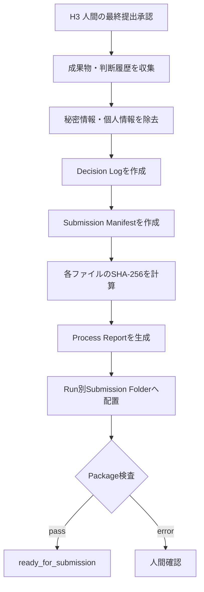

# Phase 10 Revision Backlog

現在の単一`provenance.json`保存を、完成動画、機械可読証跡、
人間が理解できる制作ストーリー、提出資料をまとめたPackageへ変更する。

## 新しい名称

状態: `pending`

```text
Provenance & Submission Package
証跡・制作ストーリー・提出パッケージ
```

Phase 10は創造的な判断を行わない。
確定した成果物と意思決定記録を収集・検証・可視化する決定論的な工程。

## 目標フロー



## 提出パッケージ

状態: `pending`

```text
submissions/
└── run-xxxx/
    ├── final_video.mp4
    ├── process_report.html
    ├── process_report.md
    ├── provenance.json
    ├── decision_log.jsonl
    ├── manifest.json
    ├── technical_report.json
    ├── storyboard.json
    ├── direction_plan.json
    ├── review_summary.json
    └── artifacts/
        ├── qa/
        ├── prompts/
        └── thumbnails/
```

### 必須成果物

- `final_video.mp4`
- `provenance.json`
- `manifest.json`
- `technical_report.json`
- `process_report.html`

### 補助成果物

- Markdown版制作レポート
- Storyboard
- Direction Plan
- Decision Log
- Review Summary
- QA Evidence
- 代表フレーム
- Promptの公開用コピー

## 出力パスの分離

状態: `pending`

現在の`final_output`を修正する。

```json
{
  "final_output": "submissions/run-xxxx/final_video.mp4",
  "provenance_output": "submissions/run-xxxx/provenance.json",
  "process_report_output": "submissions/run-xxxx/process_report.html",
  "submission_manifest": "submissions/run-xxxx/manifest.json"
}
```

完成動画、証跡、制作レポートを別フィールドで管理する。

## Decision Log

状態: `pending`

各フェーズで行われた対話、提案、判断、差し戻し、修正を
時系列のイベントとして保存する。

```json
{
  "timestamp": "2026-07-30T14:30:00+09:00",
  "run_id": "run-xxxx",
  "phase": "director",
  "cut_id": 4,
  "actor": "ai",
  "action": "revise_shot",
  "input_summary": "Visual QAで建物の変形を検出",
  "decision": "カメラを固定する",
  "rationale": "建築物の形状を維持するため",
  "evidence_refs": [
    "artifacts/qa/cut_04/frame_0049.jpg"
  ],
  "changed_fields": [
    "positive_prompt",
    "negative_prompt",
    "camera_motion"
  ],
  "confidence": 0.86
}
```

### Actor

- `human`: 人間の承認、修正指示、最終判断
- `ai`: LLMまたはVLMの提案、評価、Route判断
- `system`: Schema検証、実行上限、技術検査
- `comfy`: 画像・動画生成
- `ffmpeg`: 動画編集、Evidence抽出

### 記録する内容

- 入力の要約
- 出力の要約
- 判断
- 外部説明可能な判断理由
- 参照Evidence
- 信頼度
- 採用Route
- 人間のFeedback
- 修正前後の差分
- 実行回数
- 処理時間
- 使用モデル、Backend、Seed

## 判断理由と内部思考の区別

状態: `pending`

AIの内部思考過程をそのまま保存しない。

保存するのは、外部へ説明するために構造化して出力した次の情報。

- 判断結果
- 判断理由
- 参照Evidence
- 検討した公開可能な選択肢
- 採用しなかった理由の要約
- 信頼度
- 次のRoute

秘密の内部推論や非公開のChain of Thoughtではなく、
監査可能なDecision Rationaleを保存する。

## 修正差分

状態: `pending`

単一カット修正などでは、修正前後の構造化差分を保存する。

```diff
- camera_motion: slow forward push
+ camera_motion: locked camera, environmental motion only

- 建物へ向かって前進する
+ 建物を固定し、雲と水面の反射だけを動かす
```

差分に次を紐付ける。

- 修正対象Cut
- 修正要求者
- Feedback
- QA Issue
- Evidence
- 修正を行ったAgent
- 再生成結果
- 最終承認

## Interactive Process Report

状態: `pending`

`process_report.html`はブラウザだけで閲覧できる静的HTMLとして生成する。

### 全体画面


各ノードをクリックすると詳細パネルを開く。

### 詳細パネル

- フェーズの目的
- 入力
- AI出力
- 判断と理由
- 人間のFeedback
- 承認者
- Attempt回数
- 処理時間
- 成果物
- 画像・動画プレビュー
- QA Evidence
- 前後差分
- 次のRouteと選定理由

### ループ表示

カット単位の修正ループを時系列で表示する。

```text
Cut 4生成
→ Visual QA不合格
→ 人間がカメラ移動を弱めるよう指示
→ DirectorがCut 4だけ修正
→ ComfyUIで再生成
→ Visual QA合格
```

### Human / AIの区別

色やアイコンでActorを明示する。

- 人間の判断
- AIの提案
- AIの自動判定
- System検証
- ComfyUI生成
- FFmpeg処理

## Markdown Process Report

状態: `pending`

HTMLを開けない環境向けに、同じ情報を要約した
`process_report.md`も作る。

構成案:

1. Project概要
2. 最終成果物
3. ワークフロー全体図
4. 各フェーズの判断
5. Human-in-the-loop履歴
6. 自律実行された判断
7. カット別修正履歴
8. 使用モデル・ツール
9. 技術検査
10. AI Review Boardまたはスキップ記録
11. H3の最終承認

## ManifestとHash

状態: `pending`

各ファイルへSHA-256を付ける。

```json
{
  "run_id": "run-xxxx",
  "status": "ready_for_submission",
  "files": [
    {
      "kind": "final_video",
      "path": "final_video.mp4",
      "sha256": "...",
      "bytes": 12345678
    }
  ]
}
```

これにより、どの動画とレポートがH3で承認されたかを識別できる。

## Phase 09 Human-onlyとの連携

状態: `pending`

Phase 09が`human_only`の場合も、AI審査を実行していない事実を記録する。

```json
{
  "review_board_mode": "human_only",
  "review_board_status": "skipped",
  "skip_reason": "submission deadline priority",
  "human_final_approval": {
    "action": "approve",
    "timestamp": "..."
  }
}
```

AI評価がないことを隠さず、人間が最終判断したことを明確にする。

## 秘密情報と公開範囲

状態: `pending`

提出パッケージ作成前に次を除去する。

- API Key
- Access Token
- Secret
- Authorization Header
- ローカル環境の不要な絶対パス
- 個人情報
- 公開不要な内部設定

Promptや人間のFeedbackは、公開可能なものだけをReportへ含める。
完全版Provenanceと提出用Provenanceを分離できる設計にする。

```text
work/private/run-xxxx/provenance_full.json
submissions/run-xxxx/provenance_public.json
```

## Package検査

状態: `pending`

- 必須ファイルが存在する
- ファイルサイズが0ではない
- Final Technical QAがpass
- H3の人間承認が存在する
- ManifestのHashが実ファイルと一致する
- 秘密情報の既知パターンが残っていない
- HTML内のArtifact参照が解決できる
- `final_output`が完成動画を指す

失敗時だけ人間確認へ切り替える。

## Review Gateの変更

状態: `pending`

正常なPackage作成後は自動終了する。

- 成功: Review Gateを省略して終了
- 警告のみ: 記録して終了、または設定により確認
- 必須ファイル不足: 人間確認
- H3承認なし: 提出可能状態にしない
- 秘密情報検出: Package作成を停止

H3後の重複した常時人間確認を削減する。

## 実行上限

状態: `pending`

```yaml
execution_limits:
  max_package_attempts: 2
  max_report_render_attempts: 2
```

上限到達時は人間確認へ切り替える。

## 締切前の最小実装

1. Run ID別Submission Folderを作る
2. 完成動画を配置する
3. `final_output`を完成動画へ変更する
4. `provenance.json`をRun別に保存する
5. H3判断とPhase 09スキップ記録を含める
6. `manifest.json`を作る
7. SHA-256を計算する
8. Markdown版Process Reportを作る

インタラクティブHTMLはMarkdown版の後に追加してもよい。

## 実装順序

1. 出力パスの分離
2. Run別Submission Folder
3. Decision Event Schemaの追加
4. 修正差分とEvidence参照の記録
5. ManifestとSHA-256
6. 公開用秘密情報除去
7. Markdown Process Report Renderer
8. Interactive HTML Renderer
9. Package検査
10. Provenance Review Gateを`on_exception`へ変更

## 最小完成条件

- 完成動画と証跡をRun IDごとに保存できる
- `final_output`が完成動画を指す
- 全フェーズの結果とReview履歴を保存できる
- Phase 09スキップとH3判断を保存できる
- 人間が読める制作過程レポートを生成できる
- 人間とAIの判断を区別できる
- 判断理由とEvidenceを追跡できる
- 修正前後の差分を確認できる
- ManifestとHashで承認対象を識別できる
- 秘密情報を提出用Packageから除去できる
